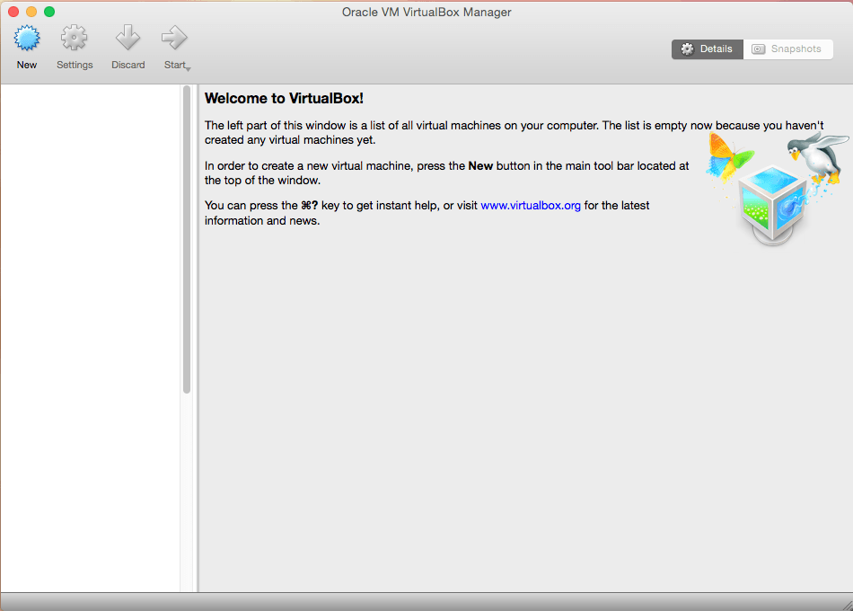
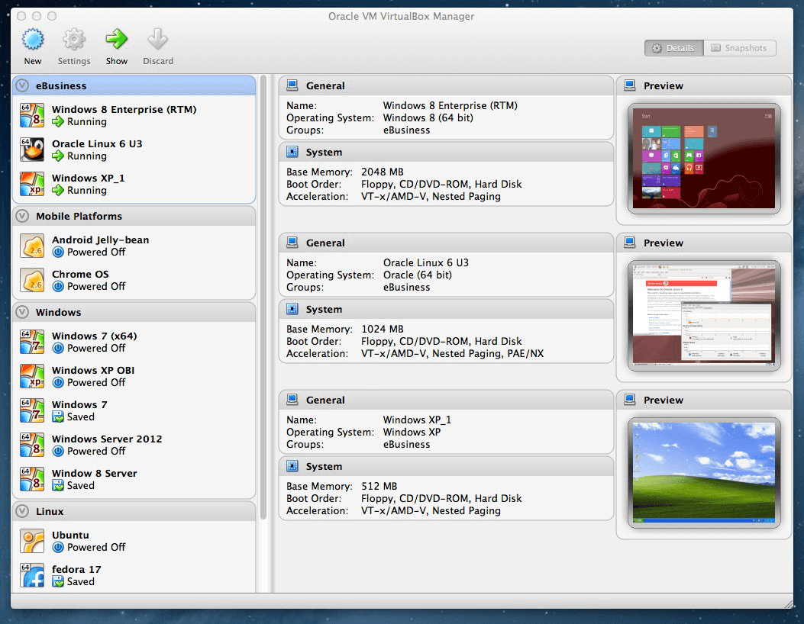

# 前言
在平时的学习过程中，需要各种各样的计算平台，特别是常用的笔记本为Windows，而工作中的服务器清一色的为Linux，这时，常常使用虚拟机来模拟Linux环境，工欲善其事必先利其器，选择并学习一款合适的虚拟机就很重要了，VMWare好用，但不是免费软件，因此选择了开源的虚拟机软件：VirtualBox，VirtualBox不仅开源，其IO性能也非常出色，为了将其使用的更好，计划对其使用进行学习，这里的内容来自其官方手册。此学习笔记也来源于其手册。  
VirtualBox官方网址：https://www.virtualbox.org/  

# 1 概述
VirtualBox是一个跨平台的虚拟化应用程序。这意味着什么？一方面，它安装在现有的基于Intel或AMD的计算机上，无论它们是运行Windows，Mac，Linux还是Solaris操作系统。其次，它扩展了现有计算机的功能，以便它可以同时运行多个操作系统（在多个虚拟机内）。例如，你可以在Mac上运行Windows和Linux，在Linux服务器上运行Windows Server 2008，在Windows PC上运行Linux。你可以根据需要安装和运行尽可能多的虚拟机，唯一的限制是磁盘空间和内存。  
VirtualBox简单明了，但非常强大。可以运行在小型嵌入式系统、桌面类机器、一直到数据中心、云环境。  

## 1.1 虚拟化为什么有用
irtualBox提供的虚拟化技术和功能对于以下几种场景是有用的：  
 - 同时运行多个操作系统。VirtualBox允许你一次运行多个操作系统。这样，你可以运行另一个操作系统上编写的软件（例如，Linux或Mac上的Windows软件）。因为你可以为每个这样的操作系统配置特定类型的“虚拟”硬件，所以即使你的实际计算机的硬件不被该操作系统支持，你任然可以在虚拟机中安装，如DOS或OS/2。  
 - 软件安装更加方便。 软件供应商可以使用虚拟机来打包整个软件配置。例如，在真实的机器上安装完整的邮件服务器可能是一个繁琐的任务。使用VirtualBox，可以将这样 一个复杂的设置（通常称为“设备”）打包到虚拟机中。安装和运行邮件服务器就像将这样的设备导入VirtualBox一样简单。  
 - 测试和灾难恢复。 一旦安装，虚拟机和其虚拟硬盘可以被当做一个容器被任意冻结，唤醒，复制，备份，以及在主机之间传递。最重要的是，通过使用另一个被称为“快照”的VirtualBox功能，你可以保存虚拟机的特定状态，并在必要时恢复到该状态。这样一来，人们就可以自由地实验一个计算环境。如果出现问题（例如在安装不正常的软件或感染病毒后），可以轻松地切换回以前的快照，这可以避免频繁的备份和恢复。你可以创建任何数量的快照，你也可以在虚拟机运行时删除快照以回收磁盘空间。  
 - 基础设施整合。 虚拟化可以显着降低硬件和电力成本。大多数情况下，当前的电脑很多情况下的平均系统负载很低，从而浪费了大量的硬件资源和电力。所以，我们不是运行这么多负载这么低的物理计算机，而是可以将许多虚拟机打包到几个强大的主机上，并平衡它们之间的负载。从而充分的利用资源。  

## 1.2 一些术语
任何软件都有其术语，VirtualBox也不例外，熟悉以下术语有助于理解它的很多知识：  
1. 主机操作系统（host OS）：安装VirtualBox的物理计算机的操作系统。  
2. 客户操作系统（guest OS）：这是在虚拟机内运行的操作系统。理论上，VirtualBox可以运行任何x86操作系统（DOS，Windows，OS / 2，FreeBSD，OpenBSD），但是为了实现虚拟机上近乎原生物理机的性能，我们针对某些操作系统进行了优化。所以当你最喜欢的操作系统作为客户操作系统运行时，可以查看我们是否针对该系统做了优化。  
3. 虚拟机（VM）：这是VirtualBox在客户机操作系统运行时创建的特殊环境。换句话说，你在VM中运行客户机操作系统。通常情况下，虚拟机显示为计算机桌面上的窗口，但根据你使用的VirtualBox的各种不同的前端，你可以以全屏模式显示，也可以在另一台计算机上远程显示。如果以更抽象的方式来看VM，在内部，VirtualBox将VM视为确定其行为的一组参数。它们包括硬件设置（VM应该有多少内存，VirtualBox应该通过哪个硬盘虚拟化容器文件，安装哪些CD等）以及状态信息（VM当前正在运行，保存，还是快照等））。这些参数在VirtualBox Manager窗口或者VBoxManage命令行程序中进行设置，换句话说，虚拟机也是你可以在对话框中看到的东西。由此可见，这里的虚拟器不仅包含了硬件参数，也包含了安装的软件（操作系统、应用软件等）。  
4. 客户机增强：这是指与VirtualBox一起提供的特殊软件包，这些软件包用于安装在VM中，以提高客户操作系统的性能并增加额外的功能（例如操作更加简便）。  

## 1.3 功能概述
以下是VirtualBox的主要功能：  
 - **可移植性：** VirtualBox运行在大量的32位和64位主机操作系统上。VirtualBox是"hosted" hypervisor（有时称为"type 2" hypervisor），需要安装在现有的操作系​​统上。而"bare-metal" 也叫做 "type 1" hypervisor可以直接在硬件上运行。在很大程度上，VirtualBox在所有主机平台上的功能是相同的，并且使用相同的文件和图像格式。这就允许你可以在Windows上创建一个虚拟机，然后在Linux下运行。此外，虚拟机可以使用开放式虚拟化格式（OVF），**你甚至可以导入使用不同虚拟化软件创建的OVF**。  
 - **不需要硬件虚拟化支持：** 多数情况下，VirtualBox不需要像Intel VT-x或AMD-V这样内置的处理器功能。这与许多其他虚拟化解决方案相反，因此即使在不存在这些功能的旧硬件上也可以使用VirtualBox。  
 - **客户机增强（Guest Additions）：** 主要有*共享文件夹，无缝窗口，3D虚拟化*。VirtualBox Guest Additions是可以安装在受支持的客户虚拟机系统内的软件包， 以提高其性能，并提供与主机系统的额外集成和通信。安装客户机增强后，虚拟机将支持自动调整分辨率，无缝窗口，加速3D图形等等。特别是Guest Additions提供了“共享文件夹”，可让你在客户机系统中访问主机系统的文件。  
 - **丰富的硬件支持：**   
  - > 客户机对称多处理（SMP）。VirtualBox可以向每个虚拟机最多显示32个虚拟CPU，而不管主机上实际存在多少CPU内核。  
  - > USB设备支持。 VirtualBox实现虚拟USB控制器，并允许你将任意USB设备连接到虚拟机，而无需在主机上安装特定的设备驱动程序。USB支持不限于某些设备类别.  
  - > 硬件兼容性。 VirtualBox虚拟化了大量的虚拟设备，其中包括许多通常由其他虚拟化平台提供的设备。包括IDE，SCSI和SATA硬盘控制器，几个虚拟网卡和声卡，虚拟串行和并行端口以及许多现代PC系统中的输入/输出高级可编程中断控制器（I/O APIC）.  
  - > 完整的ACPI支持。VirtualBox完全支持高级配置和电源接口（ACPI）。这简化了将PC映像从真实机器或第三方虚拟机克隆到VirtualBox中的过程。凭借其独特的 ACPI电源状态支持， VirtualBox甚至可以向ACPI感知客户机操作系统报告主机的电源状态。对于使用电池运行的移动系统，客户可以实现节能，并向用户通知剩余电量（例如，以全屏模式）.  
  - > 多屏幕分辨率。 VirtualBox虚拟机支持的屏幕分辨率是物理屏幕的多倍.  
  - > 内置对iSCSI的支持。 这个独特的功能允许你将虚拟机直接连接到iSCSI存储服务器，而无需通过主机系统。VM直接访问iSCSI目标.  
  - > PXE网络启动。VirtualBox的集成虚拟网卡完全支持通过预引导执行环境（PXE）远程启动.  

 - **多代分支快照：** VirtualBox可以保存虚拟机状态的任意快照。你可以及时返回并将虚拟机还原到任何此类快照，并从中启动备用的VM配置，从而有效地创建一整个快照树。你可以在虚拟机运行时创建和删除快照。  
 - **VM组：** VirtualBox提供了一个组的功能，使用户能够统一或者单独控制虚拟机。除了基本组之外，任何VM都可以在多个组中，并且组可以嵌套，即组的组。通常，可以对组执行的操作与可以对单个虚拟机执行的的操作相同，例如开始，暂停，重置，关闭（保存状态，发送关闭，关机），丢弃保存状态，在文件系统中显示，排序。  
 - **清晰的体系结构，前所未有的模块化：** VirtualBox具有非常优秀的模块化设计，具有非常明确的内部编程接口，客户端和服务器具有清晰的分离界限。这可以让你轻松地从多个接口同时对VirtualBox的虚拟机进行控制：例如，你可以通过单击VirtualBox图形用户界面中的按钮启动虚拟机，然后从命令行甚至远程控制该虚拟机。得益于其模块化的体系架构，VirtualBox还可以通过软件开发工具包（SDK，即：VirtualBox的扩展编程API）来公开其全部功能和可配置性 ，从而将VirtualBox的各个方面与其他软件系统集成。  
 - **远程机器显示：** VirtualBox远程桌面扩展（VRDE）允许对任何正在运行的虚拟机进行高性能的远程访问。此扩展程序支持最初内置于Microsoft Windows中的远程桌面协议（RDP），还特别添加了完善的客户端USB支持。VRDE不依赖于内置于Microsoft Windows中的RDP服务器; 而是直接插入虚拟化层。因此，它适用于Windows之外的客户机操作系统。  
**除此之外，VirtualBox还提供了更多独特的功能：**  
 - **可扩展的RDP认证：**VirtualBox已经支持Windows上的Winlogon和Linux上的PAM进行RDP身份验证。此外，它还包含一个易于使用的SDK，允许你为其他身份验证方法创建任意接口。  
 - **USB over RDP：**通过RDP虚拟通道支持，VirtualBox还允许您将本地的USB设备连接到在VirtualBox RDP服务器上远程运行的虚拟机。

## 1.4 支持的主机操作系统
目前，VirtualBox可以在以下主机操作系统上运行：  
 - Windows主机。  
 - Mac OS X主机（64位）。  
 - Linux主机（32位和64位 ）。  
 - Solaris主机（仅限64位）。  
更加详细的信息，去Oracle官网去查询。  

## 1.5 安装VirtualBox和扩展包
VirtualBox有许多不同的软件包，安装哪个取决于您的主机操作系统。VirtualBox的安装非常简单：在每个主机平台上，VirtualBox使用最常见且易于使用的安装方法。如果遇到麻烦或有特殊要求，有关各种安装方法的详细信息，请参阅Oracle官网的第2章。  
从4.0版开始，VirtualBox被分为几个组件：  
1. 本软件包由所有开放源代码组件组成，并根据GNU通用公共许可证V2许可。  
2. 可以下载附加的扩展包，以扩展VirtualBox基本包的功能。目前，Oracle提供了一个扩展包，可以在http://www.virtualbox.org上找到并提供以下扩展功能：  
 - 虚拟USB 2.0（EHCI）设备  
 - 虚拟USB 3.0（xHCI）设备  
 - VirtualBox远程桌面协议（VRDP）支持  
 - 主机摄像头直通  
 - 英特尔PXE引导ROM  
 - 在Linux主机上PCI实时支持实验支持  
 - 使用AES算法进行磁盘映像加密  

VirtualBox扩展包有 .vbox-extpack文件扩展名。要安装扩展程序，只需双击包文件，将出现一个网络操作管理器窗口，指导你完成所需的步骤。要查看当前安装的扩展包，请启动VirtualBox Manager（请参阅下一节）。从“文件”菜单中选择“首选项”。在显示的窗口中，转到“扩展”类别，显示当前安装的扩展，在这里你可以删除已有的扩展包或添加新的扩展。或者，你可以在命令行中使用VBoxManage查看。  

## 1.6 启动VirtualBox
安装完成后，可以启动VirtualBox：  
 - 在Windows主机上，在标准的“程序”菜单中，单击“VirtualBox”组中的项目。  
 - 在Mac OS X主机上，在Finder中，双击“Applications”文件夹中的“VirtualBox”项目。  
 - 在Linux或Solaris主机上，根据你的桌面环境，“VirtualBox”项可能已放置在“应用程序”菜单的“系统”或“系统工具”组中。或者，你可以在终端键入 VirtualBox。  
当你第一次启动VirtualBox时，应该出现以下窗口：  
  

这个窗口叫做“VirtualBox Manager”。在左侧，你可以看到一个稍后会列出所有虚拟机的窗格。由于你尚未创建任何内容，因此列表为空。上面的按钮允许您创建新的VM并在现有的虚拟机上工作，一旦你有一些VM之后。右侧的窗格显示当前选择的虚拟机的属性。由于你还没有任何虚拟机，窗格将显示欢迎消息。
为了给你一个直观的感受，VirtualBox创建了许多虚拟机之后可能看起来像下边的样子：  

    

## 1.7 创建第一个虚拟机

