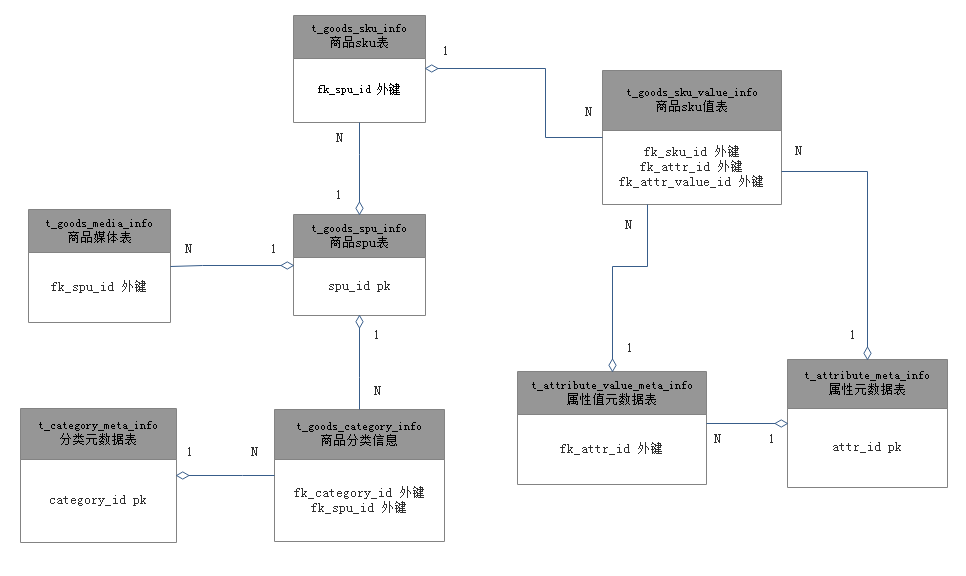
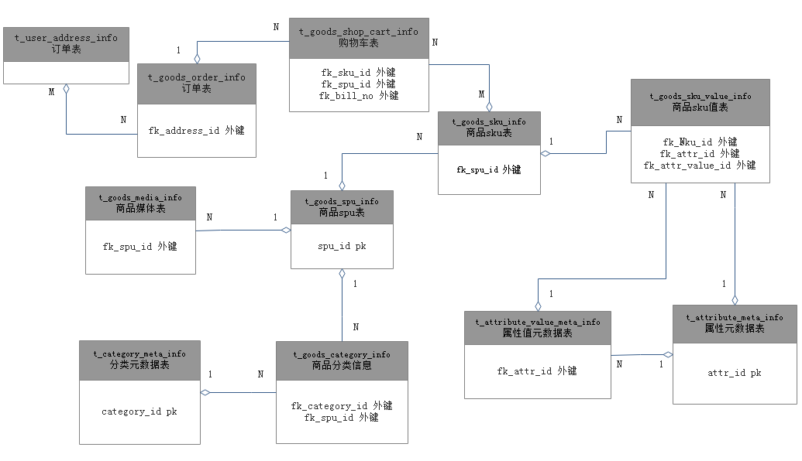

# 概述
本文分析和设计小程序涉及的表。  

# 一、商品相关表
对于电商系统而言，商品是非常重要的，设计良好的商品表不仅有助于查询，对于后期的数据分析也非常有帮助。因此我们进行详细的设计分析。  

对于一个商品，最核心的问题就是库存还有多少，为此就要明白几个概念。  

[SPU(Standard Product Unit)]()：SPU是商品信息聚合的最小单位，是一组可服用、易检索的标准化信息的集合，该集合描述了一个产品的特性。例如：iPhone X 就是一个SPU，与商家、颜色、款式、规格、套餐等都无关。iPhone X 全网通黑色256G 就是一个SKU，表示了具体的规格、颜色等信息。   

[SKU(Stock Keeping Unit)](https://zh.wikipedia.org/wiki/%E5%AD%98%E8%B4%A7%E5%8D%95%E4%BD%8D)：也翻译为库存单元，是一个会计学名词，定义为库存管理中的最小可用单元，例如纺织品中一个SKU通常表示规格、颜色、款式，而在连锁零售门店中有时称单品为一个SKU。最小库存管理单元可以区分不同商品销售的最小单元，是科学管理商品的采购、销售、物流和财务管理以及POS和MIS系统的数据统计的需求，通常对应一个管理信息系统的编码。最小库存单元是指包含特定的自然属性与社会属性的商品种类，在零售连锁门店管理中通常称为“单品”。当一种商品而言，当他的品牌、型号、配置、花色、容量、生产日期、保质期、用途、价格、产地等属性与其他商品存在不同时，就是一个不同的最小存货单元。同样品种的产品，只要在对其进行保存、管理、销售服务上有不同的方式，那么它的最小库存管理单元就不同。  

属性：用于管理各类扩展属性的集合，其中SKU属性也是在管理范畴之内。商品通过关联属性集而获得该属性集设置好的SKU属性，然后才可以根据这些SKU属性
生成商品SKU。例如：颜色、尺寸、款式等等。  

很显然，一个SPU对应多个SKU。一个SKU包含多种属性。这里就有一个问题，对于一个电商系统而言，会有千千万万个商品，每个商品会有多个互不相同的属性，这时，对于某种产品的SKU的属性个数是不同的，这时，SKU表的字段个数就是不确定的。显然，每个字段表示一个属性的方式是行不通的。那么一种商品的所有属性放在一个字段进行存储怎样呢？这种情况下，这个字段是一个列表，而且列表的长度也不一致。这种方式也不好，查询起来很麻烦。那么该怎么处理呢？  

将属性列表放在一个字段里的思路不太可行，那就将多个属性存储多条记录，并通过SKU关联。这样就会有三个基础表。  

1. 商品SPU表(t_goods_spu_info)  
2. 商品SKU表(t_goods_sku_info)  
3. 商品SKU值表(t_goods_sku_value_info)  

三张表的对应关系为：  
 - t_goods_spu_info:t_goods_sku_info 为 1:n  
 - t_goods_sku_info:t_goods_sku_value_info 为 1:n  

商品SKU值表，主要就是某个属性具有哪些值。因此，我们还需要一个属性元数据表，和属性值的元数据表。  

4. 属性元数据表(t_attribute_meta_info)
5. 属性值元数据表(t_attribute_value_meta_info)  

 - t_attribute_meta_info:t_attribute_value_meta_info 为1:n  

一个商品（SPU），还有自己的媒体信息，比如图片，视频等。这就需要一个媒体表。  
6. 商品媒体表(t_goods_media_info)  
 - t_goods_media_info:t_goods_spu_info 为 n:1  

一个商品（SPU），还有分类，,不过一个商品可以属于多个类别，因此还需要一个分类元数据表和一个商品分类表。  
7. 分类元数据表(t_category_meta_info)  
8. 商品分类信息(t_goods_category_info)  

 - t_goods_spu_info:t_goods_category_info 为 1:n  

各个表之间的关系为：  
  

## 1. 商品SPU表(t_goods_spu_info)
```sql
-- 商品spu表
CREATE TABLE `t_goods_spu_info` (
  `spu_id` int(11) NOT NULL AUTO_INCREMENT,
  `create_time` bigint(20) NOT NULL,
  `update_time` timestamp NOT NULL DEFAULT CURRENT_TIMESTAMP ON UPDATE CURRENT_TIMESTAMP,
  `name` varchar(255) NOT NULL DEFAULT '' COMMENT '商品名称',
  `brand_id` int(11) NOT NULL DEFAULT '0' COMMENT '品牌id',
  `maker_id` int(11) NOT NULL DEFAULT '0' COMMENT '生产商id',
  `s_desc` varchar(255) NOT NULL DEFAULT '' COMMENT '简述',
  `desc` text NOT NULL DEFAULT '' COMMENT '商品描述',
  `model` varchar(255) NOT NULL DEFAULT '' COMMENT '商品型号',
  `status` SMALLINT NOT NULL DEFAULT '0' COMMENT '状态 0=>新增,1=>上架,-1=>下架',
  PRIMARY KEY (`spu_id`),
  CONSTRAINT `fk_brand_id` foreign key(`brand_id`) references `t_brand_info`(`brand_id`),
  CONSTRAINT `fk_maker_id` foreign key(`maker_id`) references `t_maker_info`(`maker_id`)
) ENGINE=InnoDB AUTO_INCREMENT=1 DEFAULT CHARSET=utf8 COMMENT='商品SPU表';
```

## 2. 商品SKU表(t_goods_sku_info)  
```sql
-- 商品SKU表
CREATE TABLE `t_goods_sku_info` (
  `sku_id` int(11) NOT NULL AUTO_INCREMENT,
  `create_time` bigint(20) NOT NULL,
  `update_time` timestamp NOT NULL DEFAULT CURRENT_TIMESTAMP ON UPDATE CURRENT_TIMESTAMP,
  `name` varchar(255) NOT NULL DEFAULT '' COMMENT '名称',
  `stock` int(11) NOT NULL DEFAULT '0' COMMENT '库存',
  `warning_stock` int(11) NOT NULL DEFAULT '0' COMMENT '库存警告',
  `price` int(11) NOT NULL DEFAULT '0' COMMENT '商品价格',
  `img_url` varchar(1024) NOT NULL DEFAULT '' COMMENT '图片',
  `is_default` int(11) NOT NULL DEFAULT '0' COMMENT '是否默认sku',
  `min_count` int(11) NOT NULL DEFAULT '1' COMMENT '最小计数单位，比如扳手最想知道我的库存还有多少盒，这时候就需要填每盒多少个，该字段就是这个意思',
  `spu_id` int(11) NOT NULL DEFAULT '0' COMMENT 'spu_id',
  PRIMARY KEY (`sku_id`),
  CONSTRAINT `fk_spu_id` foreign key(`spu_id`) references `t_goods_spu_info`(`spu_id`)
) ENGINE=InnoDB AUTO_INCREMENT=1 DEFAULT CHARSET=utf8 COMMENT='商品SKU表';
```
## 3. 商品SKU值表(t_goods_sku_value_info)  
```sql
-- 商品SKU值表
CREATE TABLE `t_goods_sku_value_info` (
  `sku_value_id` int(11) NOT NULL AUTO_INCREMENT,
  `create_time` bigint(20) NOT NULL,
  `update_time` timestamp NOT NULL DEFAULT CURRENT_TIMESTAMP ON UPDATE CURRENT_TIMESTAMP,
  `sku_id` int(11) NOT NULL DEFAULT '0' COMMENT 'sku_id 该SKU值属于哪个SKU',
  `attr_id` int(11) NOT NULL DEFAULT '0' COMMENT 'attr_id 该SKU值表示的是哪个属性',
  `attr_value_id` int(11) NOT NULL DEFAULT '0' COMMENT 'attr_value_id 该SKU值表示的那个属性的值',
  PRIMARY KEY (`sku_value_id`),
  UNIQUE KEY `uk_sku_attr_value` (`sku_id`, `attr_id`, `attr_value_id`),
  CONSTRAINT `fk_sku_id` foreign key(`sku_id`) references `t_goods_sku_info`(`sku_id`),
  CONSTRAINT `fk_attr_id` foreign key(`attr_id`) references `t_attribute_meta_info`(`attr_id`),
  CONSTRAINT `fk_attr_value_id` foreign key(`attr_value_id`) references `t_attribute_value_meta_info`(`attr_value_id`)
) ENGINE=InnoDB AUTO_INCREMENT=1 DEFAULT CHARSET=utf8 COMMENT='商品SKU值表';
```

## 4. 属性元数据表(t_attribute_meta_info)
```sql
-- 属性元数据表
CREATE TABLE `t_attribute_meta_info` (
  `attr_id` int(11) NOT NULL AUTO_INCREMENT COMMENT '属性的id',
  `create_time` bigint(20) NOT NULL,
  `update_time` timestamp NOT NULL DEFAULT CURRENT_TIMESTAMP ON UPDATE CURRENT_TIMESTAMP,
  `name` varchar(128) NOT NULL DEFAULT '' COMMENT '名称',
  `desc` varchar(255) NOT NULL DEFAULT '' COMMENT '属性描述'
  PRIMARY KEY (`attr_id`),
  UNIQUE KEY `uk_name` (`name`)
) ENGINE=InnoDB AUTO_INCREMENT=1 DEFAULT CHARSET=utf8 COMMENT='属性元数据表';

insert into t_attribute_info(`attr_id`, `create_time`, `name`) values 
(1, 1460944430, '颜色'),
(2, 1460944430, '尺寸'),
(3, 1460944430, '容量'),
(4, 1460944430, '材质');
```

## 5. 属性值元数据表(t_attribute_value_meta_info)
```sql
-- 属性值元数据表
CREATE TABLE `t_attribute_value_meta_info` (
  `attr_value_id` int(11) NOT NULL AUTO_INCREMENT COMMENT '值对应的id',
  `create_time` bigint(20) NOT NULL,
  `update_time` timestamp NOT NULL DEFAULT CURRENT_TIMESTAMP ON UPDATE CURRENT_TIMESTAMP,
  `name` varchar(255) NOT NULL DEFAULT '' COMMENT '名称',
  `attr_id` int(11) NOT NULL DEFAULT '0' COMMENT 'attr_id 改值属于哪个属性,一个属性有多个值',
  PRIMARY KEY (`attr_value_id`),
  CONSTRAINT `fk_attr_id` foreign key(`attr_id`) references `t_attribute_meta_info`(`attr_id`),
  UNIQUE KEY `uk_attr_id_name` (`attr_id`, `name`)
) ENGINE=InnoDB AUTO_INCREMENT=1 DEFAULT CHARSET=utf8 COMMENT='属性值元数据表';
insert into t_attribute_value_info(`attr_value_id`, `create_time`, `name`, `attr_id`) values 
(1, 1500003450, '红色', 1),
(2, 1500003450, '黑色', 1),
(3, 1500003450, '32GB', 3),
(4, 1500003450, '64GB', 3);

```

## 6. 商品媒体表(t_goods_media_info)
```sql
-- 商品媒体表
CREATE TABLE `t_goods_media_info` (
  `media_id` int(11) NOT NULL AUTO_INCREMENT,
  `create_time` bigint(20) NOT NULL,
  `update_time` timestamp NOT NULL DEFAULT CURRENT_TIMESTAMP ON UPDATE CURRENT_TIMESTAMP,
  `type` int(11) NOT NULL DEFAULT '0' COMMENT '媒体类型 1-图片，2-视频',
  `position` int(11) NOT NULL DEFAULT '0' COMMENT '显示位置 1-主图/视频，2-轮播图，3-内容图',
  `media_url` varchar(1024) NOT NULL DEFAULT '' COMMENT '媒体utl',
  `spu_id` int(11) NOT NULL DEFAULT '0' COMMENT 'spu_id 哪个商品的媒体',
  PRIMARY KEY (`media_id`),
  CONSTRAINT `fk_spu_id` foreign key(`spu_id`) references `t_goods_sku_info`(`spu_id`)
) ENGINE=InnoDB AUTO_INCREMENT=1 DEFAULT CHARSET=utf8 COMMENT='商品媒体表';
```

## 7. 分类元数据表(t_category_meta_info)
```sql
-- 分类元数据表
CREATE TABLE `t_category_meta_info` (
  `category_id` int(11) NOT NULL AUTO_INCREMENT,
  `create_time` bigint(20) NOT NULL,
  `update_time` timestamp NOT NULL DEFAULT CURRENT_TIMESTAMP ON UPDATE CURRENT_TIMESTAMP,
  `name` varchar(64) NOT NULL DEFAULT '' COMMENT '分类名称',
  `desc` varchar(255) NOT NULL DEFAULT '' COMMENT '分类描述',
  `parent_id` int(11) NOT NULL DEFAUTL'0' COMMENT '父类id',
  `level` int(11) NOT NULL DEFAUTL'0' COMMENT '1-一级分类，2-二级分类，3-三级分类 以此类推.....',
  `img_url` varchar(1024) NOT NULL DEFAULT '' COMMENT '分类图标',
  PRIMARY KEY (`category_id`),
  UNIQUE KEY `uk_name_parent_id` (`name`, `parent_id`)
) ENGINE=InnoDB AUTO_INCREMENT=1 DEFAULT CHARSET=utf8 COMMENT='分类元数据表';
```

## 8. 商品分类信息(t_goods_category_info)  
```sql
-- 商品分类信息 一个商品可以属于多类，而且这张表要存储这个商品的各级分类
CREATE TABLE `t_goods_category_info` (
  `goods_cat_id` int(11) NOT NULL AUTO_INCREMENT,
  `create_time` bigint(20) NOT NULL,
  `update_time` timestamp NOT NULL DEFAULT CURRENT_TIMESTAMP ON UPDATE CURRENT_TIMESTAMP,
  `spu_id` int(11) NOT NULL DEFAULT '0' COMMENT 'spu_id 商品',
  `category_id` int(11) NOT NULL DEFAULT '0' COMMENT 'category_id 商品的分类id，一个商品可以属于多类',
  PRIMARY KEY (`goods_cat_id`),
  UNIQUE KEY `uk_spu_category` (`category_id`, `spu_id`),
  CONSTRAINT `fk_category_id` foreign key(`category_id`) references `t_category_meta_info`(`category_id`),
  CONSTRAINT `fk_spu_id` foreign key(`spu_id`) references `t_goods_sku_info`(`spu_id`)
) ENGINE=InnoDB AUTO_INCREMENT=1 DEFAULT CHARSET=utf8 COMMENT='商品分类信息';
```

此外还需要品牌表和生产商表，不过这个两个表只是信息的存储，不像SKU那么核心，因此不在表之间的关系图中画出了，在此给出他们的表定义。  


## 9. 品牌表(t_brand_info)  
```sql
-- 品牌表
CREATE TABLE `t_brand_info` (
  `brand_id` int(11) NOT NULL AUTO_INCREMENT,
  `create_time` bigint(20) NOT NULL,
  `update_time` timestamp NOT NULL DEFAULT CURRENT_TIMESTAMP ON UPDATE CURRENT_TIMESTAMP,
  `name` varchar(128) NOT NULL DEFAULT '' COMMENT '品牌名称',
  `desc` varchar(512) NOT NULL DEFAULT '' COMMENT '品牌描述',
  PRIMARY KEY (`brand_id`),
  UNIQUE KEY `uk_name` (`name`)
) ENGINE=InnoDB AUTO_INCREMENT=1 DEFAULT CHARSET=utf8 COMMENT='品牌表';
```

## 10. 生产商表(t_maker_info)  
```sql
-- 生产商表
CREATE TABLE `t_maker_info` (
  `maker_id` int(11) NOT NULL AUTO_INCREMENT,
  `create_time` bigint(20) NOT NULL,
  `update_time` timestamp NOT NULL DEFAULT CURRENT_TIMESTAMP ON UPDATE CURRENT_TIMESTAMP,
  `name` varchar(128) NOT NULL DEFAULT '' COMMENT '生产商名称',
  `desc` varchar(512) NOT NULL DEFAULT '' COMMENT '生产商描述',
  PRIMARY KEY (`maker_id`),
  UNIQUE KEY `uk_name` (`name`)
) ENGINE=InnoDB AUTO_INCREMENT=1 DEFAULT CHARSET=utf8 COMMENT='生产商表';
```

至此，商品相关的存储表就设计好了。  

# 二、订单相关表

上边设计了商品表，对于电商系统来说，订单也是非常重要的一环，接下来设计订单表。  

我们在网上购物的时候会先选择商品，然后将商品加入购物车，选择好之后，将购物车中的商品提交，这时候就形成订单，进入付款发货环节。因此，至少需要购物车表和订单表。  

1. 购物车表(t_goods_shop_cart_info)  
2. 订单表(t_goods_order_info)  
3. 收获地址表(t_user_address_info)

一个用户购物车可以有很多商品，每个商品(sku)一条记录，一个订单可以包含多条商品，即：订单表和商品表是一对多的关系（1个订单多个商品），而且在从购物车提交订单的时候，需要将购物车的数据删除（这里并不是真正的删除，而是会使用一个状态信息），加到订单表里。

## 1. 购物车表(t_goods_shop_cart_info)
```sql
-- 购物车表
CREATE TABLE `t_goods_shop_cart_info` (
  `cart_id` int(11) NOT NULL AUTO_INCREMENT,
  `create_time` bigint(20) NOT NULL,
  `update_time` timestamp NOT NULL DEFAULT CURRENT_TIMESTAMP ON UPDATE CURRENT_TIMESTAMP,
  `spu_id` int(11) NOT NULL DEFAULT '0' COMMENT 'spu_id',
  `sku_id` int(11) NOT NULL DEFAULT '0' COMMENT 'sku_id',
  `uid` int(11) NOT NULL DEFAULT '0' COMMENT '用户id',
  `tran_price` int(11) NOT NULL DEFAULT '0' COMMENT '成交价格，在提交订单后由卖家和买家商量好后设定，加入购物车的时候改值不设定',
  `price` int(11) NOT NULL DEFAULT '0' COMMENT '商品价格，需要从商品表那里同步过来，因为后续这个商品可能降价，但是加入购物车时的价格是确定的',
  `num` int(11) NOT NULL DEFAULT '0' COMMENT '商品的数量',
  `status` int(11) NOT NULL DEFAULT '0' COMMENT '状态 0-新加入购物车，1-已提交订单，为0的可以删除，为1的不可以删除，因为订单已经提交',
  `bill_no` varchar(128) NOT NULL DEFAULT '' COMMENT '订单号，提交时进行设置',
  `union_id` varchar(64) NOT NULL DEFAULT '' COMMENT '用户在小程序中微信的openid',
  PRIMARY KEY (`cart_id`),
  CONSTRAINT `fk_spu_id` foreign key(`spu_id`) references `t_goods_spu_info`(`spu_id`),
  CONSTRAINT `fk_sku_id` foreign key(`sku_id`) references `t_goods_sku_info`(`sku_id`),
  CONSTRAINT `fk_bill_no` foreign key(`bill_no`) references `t_goods_order_info`(`bill_no`),
  UNIQUE KEY `uk_sku_bill_no` (`sku_id`, `bill_no`)
) ENGINE=InnoDB AUTO_INCREMENT=1 DEFAULT CHARSET=utf8 COMMENT='购物车表';
```

## 2. 订单表(t_goods_order_info) 
```sql
-- 订单表
CREATE TABLE `t_goods_order_info` (
  `order_id` int(11) NOT NULL AUTO_INCREMENT,
  `create_time` bigint(20) NOT NULL,
  `update_time` timestamp NOT NULL DEFAULT CURRENT_TIMESTAMP ON UPDATE CURRENT_TIMESTAMP,
  `bill_no` varchar(128) NOT NULL DEFAULT '' COMMENT '订单号，提交时进行设置',
  `uid` int(11) NOT NULL DEFAULT '0' COMMENT '用户id',
  `pay_way` int(11) NOT NULL DEFAULT '0' COMMENT '支付方式 1-货到付款，2-微信支付，3-银行卡',
  `pay_time_ts` bigint(20) NOT NULL DEFAULT '0' COMMENT '支付时间',
  `status` int(11) NOT NULL DEFAULT '0' COMMENT '订单状态 1-新提交待确认，2-已确认(商量价格、确认发货地址等)，3-已发货代付款，4-已发货已付款',
  `money` int(11) NOT NULL DEFAULT '0' COMMENT '商品金额，在订单新提交时计算',
  `tran_money` int(11) NOT NULL DEFAULT '0' COMMENT '实际支付金额，在status设置为2时进行更新',
  `freight` int(11) NOT NULL DEFAULT '0' COMMENT '运费',
  `address_id` int(11) NOT NULL DEFAULT '0' COMMENT 'address_id收获地址',
  `union_id` varchar(64) NOT NULL DEFAULT '' COMMENT '用户在小程序中微信的openid',
  PRIMARY KEY (`order_id`),
  CONSTRAINT `fk_address_id` foreign key(`address_id`) references `t_user_address_info`(`address_id`),
  UNIQUE KEY `uk_bill_no` (`bill_no`)
) ENGINE=InnoDB AUTO_INCREMENT=1 DEFAULT CHARSET=utf8 COMMENT='订单表';
```

## 3. 收获地址表(t_user_address_info)
```sql
-- 收获地址表
CREATE TABLE `t_user_address_info` (
  `address_id` int(11) NOT NULL AUTO_INCREMENT,
  `create_time` bigint(20) NOT NULL,
  `update_time` timestamp NOT NULL DEFAULT CURRENT_TIMESTAMP ON UPDATE CURRENT_TIMESTAMP,
  `uid` int(11) NOT NULL DEFAULT '0' COMMENT '用户id',
  `phone_num` varchar(16) NOT NULL DEFAULT '' COMMENT '手机号',
  `province` varchar(32) NOT NULL DEFAULT '' COMMENT '省',
  `city` varchar(32) NOT NULL DEFAULT '' COMMENT '市',
  `county` varchar(32) NOT NULL DEFAULT '' COMMENT '区县',
  `address_detail` varchar(256) NOT NULL DEFAULT '' COMMENT '详细地址',
  `receiver` varchar(32) NOT NULL DEFAULT '' COMMENT '收货人',
  `union_id` varchar(64) NOT NULL DEFAULT '' COMMENT '用户在小程序中微信的openid',
  PRIMARY KEY (`address_id`)
) ENGINE=InnoDB AUTO_INCREMENT=1 DEFAULT CHARSET=utf8 COMMENT='收获地址表';
```

由此得到具有订单号的er图
  


