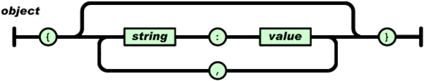
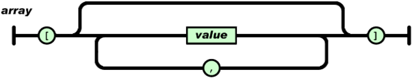
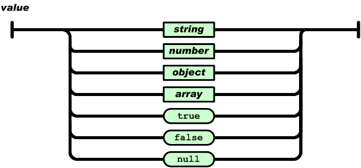
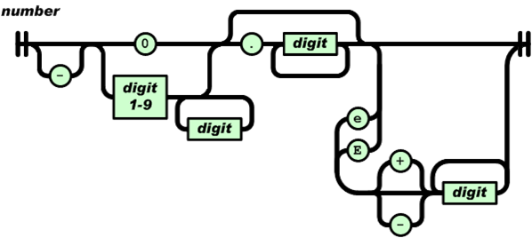

# 1 JSON数据格式

## 1.1 JSON数据格式说明
正如YAML文档中描述的那样：  
从结构上看，所有的数据（data）最终都可以分解成三种类型：  
 - 第一种类型是标量，也就是一个单独的字符串（string）或数字（numbers），比如"hello"这个单独的词。  
 - 第二种类型是序列（sequence），也就是若干个相关的数据按照一定顺序并列在一起，又叫做数组（array）或列表（List），比如["hello", "tencent"]。  
 - 第三种类型是映射（mapping），也就是一个名/值对（Name/value），即数据有一个名称，还有一个与之相对应的值，这又称作散列（hash）或字典（dictionary），比如"name":"xufubo"。  
由此可见：只要有了数组（array）和对象（object）就能够储存一切数据了。  
JSON就是基于这三点设计出来的。  
 - JSON官方中文介绍：http://www.json.org/json-zh.html  
 - JSON官方英文介绍：http://www.json.org  

JSON是一种轻量级的数据交换格式。 易于人阅读和编写。同时也易于机器解析和生成。采用完全独立于语言的文本格式。JSON建构于两种结构：  
 - “名称/值”对的集合（A collection of name/value pairs）。不同的语言中，它被理解为对象（object），纪录（record），结构（struct），字典（dictionary），哈希表（hash table），有键列表（keyed list），或者关联数组 （associative array）。
 - 值的有序列表（An ordered list of values）。在大部分语言中，它被理解为数组（array）。  
这些都是常见的数据结构。事实上大部分现代计算机语言都以某种形式支持它们。这使得一种数据格式在同样基于这些结构的编程语言之间交换成为可能。  
JSON的规格非常之简单，它有如下几条规则：  
 - 并列的数据之间用逗号（", "）分隔。  
 - 映射用冒号（":"）表示。
 - 并列数据的集合（数组）用方括号("[]")表示。  
 - 映射的集合（对象）用大括号（"{}"）表示。  
JSON值具体包含如下几种：  

 - 对象：对象是一个无序的“‘名称/值’对”集合。一个对象以“{”（左括号）开始，“}”（右括号）结束。每个“名称”后跟一个“:”（冒号）；“‘名称/值’ 对”之间使用“,”（逗号）分隔。图示如下：  
   

 - 数组：数组是值（value）的有序集合。一个数组以“[”（左中括号）开始，“]”（右中括号）结束。值之间使用“,”（逗号）分隔。当然了，值也可以为对象。图示如下：  
   

 - 值：值（value）可以包含如下几种：双引号括起来的字符串（string）、数值(number)、true、false、 null、对象（object）或者数组（array）。这些结构可以嵌套。最后的说明很关键。这些结构之间可以互相嵌套。图示如下：  
   

 - 针对字符串的说明：字符串（string）是由双引号包围的任意数量Unicode字符的集合，使用反斜线转义。一个字符串值中包含如下字符时，需要转义，否则会当作特殊字符处理。  
   

 - 数值：数值（number）也与C或者Java的数值非常相似。除去未曾使用的八进制与十六进制格式。图示如下：  
   

## 1.2 JSON对象举例
如下为一个JSON对象，一个字符串。   
```json
{
	"body": {
		"appIdList": [10415519,
		1242153]
	},
	"head": {
		"businessId": "qq_dynamic_search",
		"client_ip": "",
		"cmd": "getPkgNameByAppId",
		"nonce": 1469423984,
		"requestId": 3,
		"timestamp": 1469423984,
		"uniqueId": "qq_dynamic_search"
	}
}
```
如上、其实本质上一个JSON值（一个JSON串）就是一个JSON对象的值。并且如上所说，对象、数组、标量之间可以嵌套。  

# 2 Base64编解码
## 2.1 Base64编解码原理
顾名思义，Base64编解码就是说选出64个字符（可编辑、可见、可打印字符）作为一个基本字符集。然后，将其他的所有符号都转换成这个字符集中的字符。选出的64个字符为：大写字母A—Z，小写字母a—z，+、/再加上作为垫字符的=，实际上是65个字符，不过有意义的只有64个字符。
各个字符在Base64中对应的二进制值的对照表如下：  

|编号|字符|   
|-|-|-|-|-|-|-|-|-|-|-|-|-|-|-|-|-|-|-|-|-|-|-|   
|0|A||8|I| |16|Q||24|Y||32|g||40|o||48|w||56|4|   
|1|B||9|J| |17|R||25|Z||33|h||41|p||49|x||57|5|   
|2|C||10|K||18|S||26|a||34|i||42|q||50|y||58|6|   
|3|D||11|L||19|T||27|b||35|j||43|r||51|z||59|7|   
|4|E||12|M||20|U||28|c||36|k||44|s||52|0||60|8|   
|5|F||13|N||21|V||29|d||37|l||45|t||53|1||61|9|   
|6|G||14|O||22|W||30|e||38|m||46|u||54|2||62|+|   
|7|H||15|P||23|X||31|f||39|n||47|v||55|3||63|/|   

具体的转换规则如下：  
 - 第一步：将每三个字节作为一组，一共是24个二进制位。
 - 第二步：将这24个二进制位分为四组，每个组有6个二进制位。
 - 第三步：在每组前面加两个00，扩展成32个二进制位，即四个字节。
 - 第四步：根据上表，得到扩展后的每个字节的对应符号，这就是Base64的编码值。
由上我们可以看到：Base64是将三个字节转化为四个字节，因此被Base64编码后的数据，会比原来的文本大出三分之一左右。  

## 2.2 Base64编码实例
以Man为例：  
 - 第一步，"M"、"a"、"n"的ASCII值分别是77、97、110，对应的二进制值是01001101、01100001、01101110，将它们连成一个24位的二进制字符串010011010110000101101110。  
 - 第二步，将这个24位的二进制字符串分成4组，每组6个二进制位：010011、010110、000101、101110。  
 - 第三步，在每组前面加两个00，扩展成32个二进制位，即四个字节：00010011、00010110、00000101、00101110。它们的十进制值分别是19、22、5、46。  
 - 第四步，根据上表，得到每个值对应Base64编码，即T、W、F、u。  

因此，Man的Base64编码就是TWFu。  
那么字节不足三个情况该如何处理呢？  
 - 二个字节的情况：将这二个字节的一共16个二进制位，按照上面的规则，转成三组，最后一组除了前面加两个0以外，后面也要加两个0。这样得到一个三位的Base64编码，再在末尾补上一个"="号。  
 比如，"Ma"这个字符串是两个字节，可以转化成三组00010011、00010110、00010000以后，对应Base64值分别为T、W、E，再补上一个"="号，因此"Ma"的Base64编码就是TWE=。  
 - 一个字节的情况：将这一个字节的8个二进制位，按照上面的规则转成二组，最后一组除了前面加二个0以外，后面再加4个0。这样得到一个二位的Base64编码，再在末尾补上两个"="号。  
 比如，"M"这个字母是一个字节，可以转化为二组00010011、00010000，对应的Base64值分别为T、Q，再补上二个"="号，因此"M"的Base64编码就是TQ==。  

## 2.3 实现Base64算法
头文件：  
```C++
class TC_Base64
{
public:
    /*
     * @param data         需要编码的数据
	 * @param bChangeLine  是否需要在最终编码数据加入换行符 ，
	 *     				   (RFC中建议每76个字符后加入回车换行，默认为不添加换行
     * @return string      编码后的数据
     */
    static string encode(const string &data, bool bChangeLine = false);
    
    /*
     * @param data：需要解码的数据, 
     * @return string：解码后的数据 
     */
    static string decode(const string &data);

    /*
	 * @brief  对字符串进行base64编码 . 
     * @param pSrc        需要编码的数据
     * @param nSrcLen     需要编码的数据长度
     * @param pDst        编码后的数据      
	 * @param bChangeLine 是否需要在最终编码数据加入换行符， 
	 *   				  RFC中建议每76个字符后加入回车换行，默认为不添加换行
     * @return            编码后的字符串的长度
     */
    static int encode(const unsigned char* pSrc, int nSrcLen, char* pDst, bool bChangeLine = false);
    
    /*
	 * @brief  对字符串进行base64解码. 
     * @param pSrc    需要解码的数据    
     * @param nSrcLe  需要解码的数据长度
     * @param pDst   解码后的数据
     * @return       解码后的字符串的长度
	 */    
    static int decode(const char* pSrc, int nSrcLen, unsigned char* pDst);
protected:
    //base64编码表
    static const char EnBase64Tab[];
    //base64解码表
    static const char DeBase64Tab[];
};
```

函数实现：  
```C++
// Base64编码表：将输入数据流每次取6 bit，用此6 bit的值(0-63)作为索引去查表，输出相应字符。不满4个字符的以'='填充。
const char  TC_Base64::EnBase64Tab[] = "ABCDEFGHIJKLMNOPQRSTUVWXYZabcdefghijklmnopqrstuvwxyz0123456789+/";
    
// Base64解码表：将64个可打印字符的值作为索引，查表得到的值（范围为0-63）依次连起来得到解码结果。
// 解码表size为256，非法字符将被解码为ASCII 0
const char  TC_Base64::DeBase64Tab[] =
{
    0, 0, 0, 0, 0, 0, 0, 0, 0, 0, 0, 0, 0, 0, 0, 0, 0, 0, 0, 0, 0, 0,
    0, 0, 0, 0, 0, 0, 0, 0, 0, 0, 0, 0, 0, 0, 0, 0, 0, 0, 0, 0, 0, 
    62,        // '+'
    0, 0, 0,
    63,        // '/'
    52, 53, 54, 55, 56, 57, 58, 59, 60, 61,        // '0'-'9'
    0, 0, 0, 0, 0, 0, 0,
    0, 1, 2, 3, 4, 5, 6, 7, 8, 9, 10, 11, 12,
    13, 14, 15, 16, 17, 18, 19, 20, 21, 22, 23, 24, 25,        // 'A'-'Z'
    0, 0, 0, 0, 0, 0,
    26, 27, 28, 29, 30, 31, 32, 33, 34, 35, 36, 37, 38,
    39, 40, 41, 42, 43, 44, 45, 46, 47, 48, 49, 50, 51,        // 'a'-'z'
    0, 0, 0, 0, 0, 0, 0, 0, 0, 0, 0, 0, 0, 0, 0, 0, 0, 0, 0, 0, 0, 0, 0, 0, 0, 0, 0, 0, 0, 0,
    0, 0, 0, 0, 0, 0, 0, 0, 0, 0, 0, 0, 0, 0, 0, 0, 0, 0, 0, 0, 0, 0, 0, 0, 0, 0, 0, 0, 0, 0,
    0, 0, 0, 0, 0, 0, 0, 0, 0, 0, 0, 0, 0, 0, 0, 0, 0, 0, 0, 0, 0, 0, 0, 0, 0, 0, 0, 0, 0, 0,
    0, 0, 0, 0, 0, 0, 0, 0, 0, 0, 0, 0, 0, 0, 0, 0, 0, 0, 0, 0, 0, 0, 0, 0, 0, 0, 0, 0, 0, 0,
    0, 0, 0, 0, 0, 0, 0, 0, 0, 0, 0, 0, 0
};
string TC_Base64::encode(const string &data, bool bChangeLine/* = false*/)
{
    if(data.empty())
        return "";    
    //设原始串长度为a,结果串中算上回车换行及'/0',最终长度为(a/3+1)*4+(a/3+1)*4*2/76+1,约为1.369*a+6
    char *pDst = NULL;
    int iBufSize = (int)(data.size()*1.4) + 6;
    pDst = new char[iBufSize];
    if(pDst == NULL)
        return "";   
    int iDstLen = encode((unsigned char*)data.c_str(), data.size(), pDst, bChangeLine);
    string ret(pDst,iDstLen);
    delete [] pDst;
    return ret;
}
string TC_Base64::decode(const string &data)
{
    if(data.empty())
        return "";
    unsigned char *pDst = NULL;  
    pDst = new unsigned char[data.size()];
    if(pDst == NULL)
        return "";
    int iDstLen = decode(data.c_str(), data.size(), pDst);
    string ret((char*)pDst,iDstLen);
    delete [] pDst;
    return ret;
}
int TC_Base64::encode(const unsigned char* pSrc, int nSrcLen, char* pDst, bool bChangeLine/* = false*/)
{
    unsigned char c1, c2, c3;   
    int nDstLen = 0;             
    int nLineLen = 0;         
    int nDiv = nSrcLen / 3;      
    int nMod = nSrcLen % 3;    
    // 每次取3个字节，编码成4个字符
    for (int i = 0; i < nDiv; i ++)
    {
        c1 = *pSrc++;
        c2 = *pSrc++;
        c3 = *pSrc++;
 
        *pDst++ = EnBase64Tab[c1 >> 2];
        *pDst++ = EnBase64Tab[((c1 << 4) | (c2 >> 4)) & 0x3f];
        *pDst++ = EnBase64Tab[((c2 << 2) | (c3 >> 6)) & 0x3f];
        *pDst++ = EnBase64Tab[c3 & 0x3f];
        nLineLen += 4;
        nDstLen += 4;
        // 相关RFC中每行超过76字符时需要添加回车换行
        if (bChangeLine && nLineLen > 72)
        {
            *pDst++ = '\r';
            *pDst++ = '\n';
            nLineLen = 0;
            nDstLen += 2;
        }
    }
    // 编码余下的字节
    if (nMod == 1)
    {
        c1 = *pSrc++;
        *pDst++ = EnBase64Tab[(c1 & 0xfc) >> 2];
        *pDst++ = EnBase64Tab[((c1 & 0x03) << 4)];
        *pDst++ = '=';
        *pDst++ = '=';
        nLineLen += 4;
        nDstLen += 4;
    }
    else if (nMod == 2)
    {
        c1 = *pSrc++;
        c2 = *pSrc++;
        *pDst++ = EnBase64Tab[(c1 & 0xfc) >> 2];
        *pDst++ = EnBase64Tab[((c1 & 0x03) << 4) | ((c2 & 0xf0) >> 4)];
        *pDst++ = EnBase64Tab[((c2 & 0x0f) << 2)];
        *pDst++ = '=';
        nDstLen += 4;
    }
    // 输出加个结束符
    *pDst = '\0';
 
    return nDstLen;
}
int  TC_Base64::decode(const char* pSrc, int nSrcLen, unsigned char* pDst)
{
    int nDstLen;            // 输出的字符计数 
    int nValue;             // 解码用到的整数
    int i; 
    i = 0;
    nDstLen = 0;
 
    // 取4个字符，解码到一个长整数，再经过移位得到3个字节
    while (i < nSrcLen)
    {    
        // 跳过回车换行    
        if (*pSrc != '\r' && *pSrc!='\n')
        {
            if(i + 4 > nSrcLen)     //待解码字符串不合法，立即停止解码返回
                break;           

            nValue = DeBase64Tab[int(*pSrc++)] << 18;         
            nValue += DeBase64Tab[int(*pSrc++)] << 12;
            *pDst++ = (nValue & 0x00ff0000) >> 16;
            nDstLen++; 
            if (*pSrc != '=')
            {                
                nValue += DeBase64Tab[int(*pSrc++)] << 6;
                *pDst++ = (nValue & 0x0000ff00) >> 8;
                nDstLen++; 
                if (*pSrc != '=')
                {                    
                    nValue += DeBase64Tab[int(*pSrc++)];
                    *pDst++ =nValue & 0x000000ff;
                    nDstLen++;
                }
            }
            i += 4;
        }
        else       
        {
            pSrc++;
            i++;
        }
     }
    // 输出加个结束符
    *pDst = '\0'; 
    return nDstLen;
}
```


