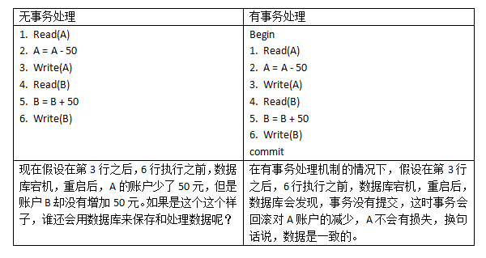
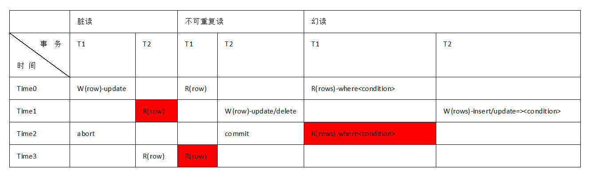
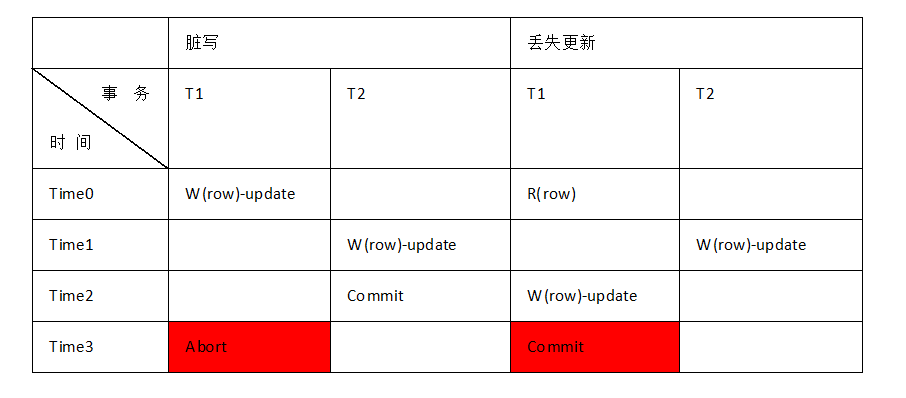
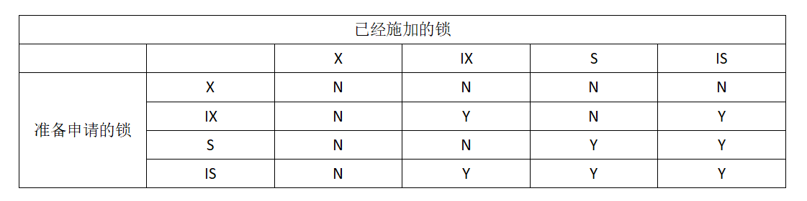
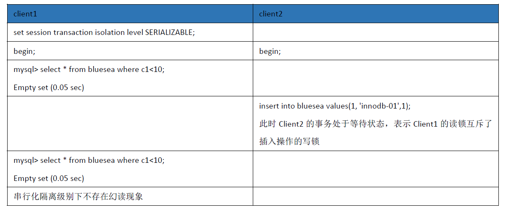
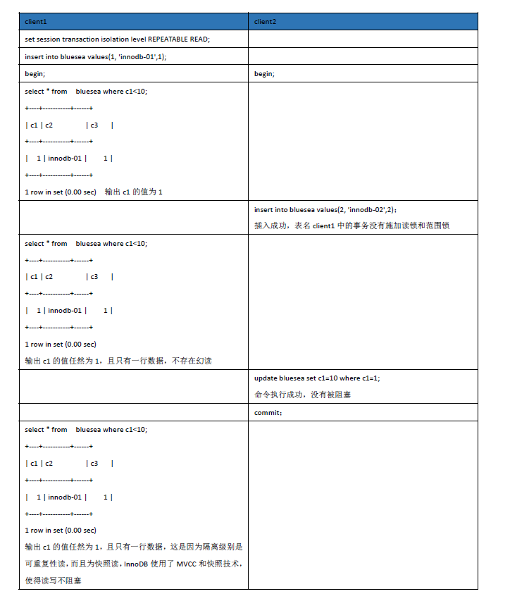
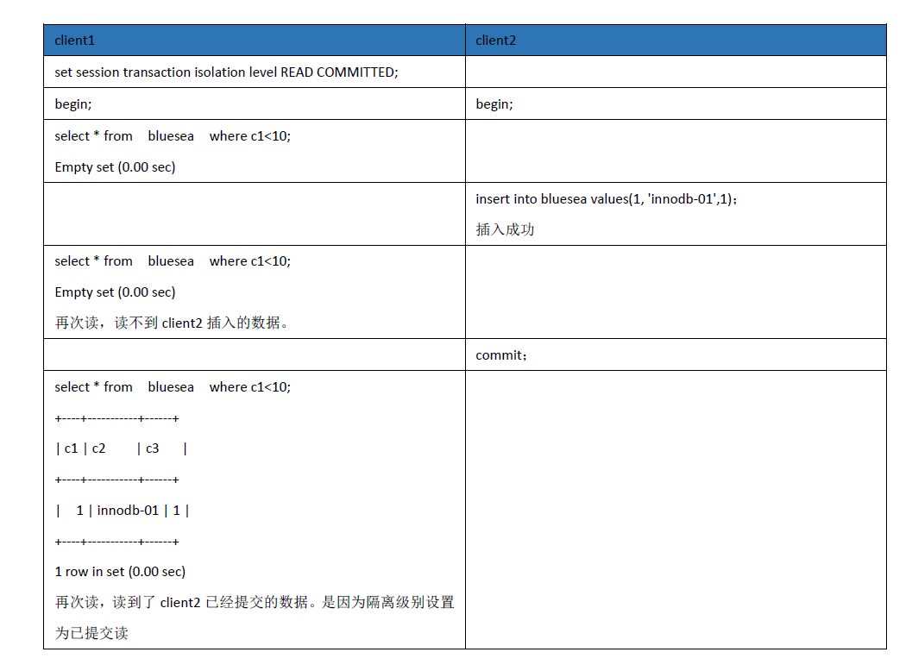
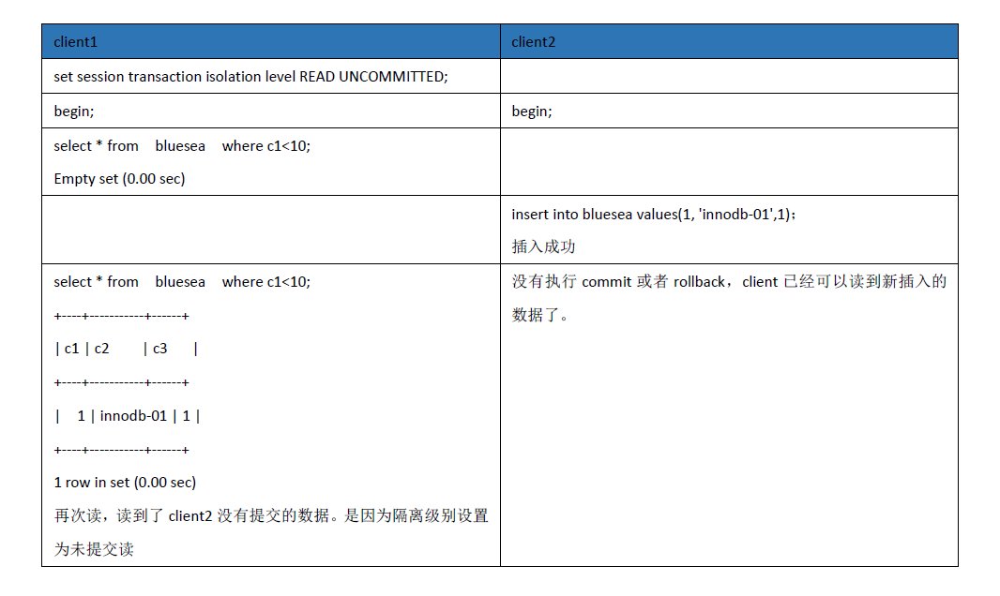
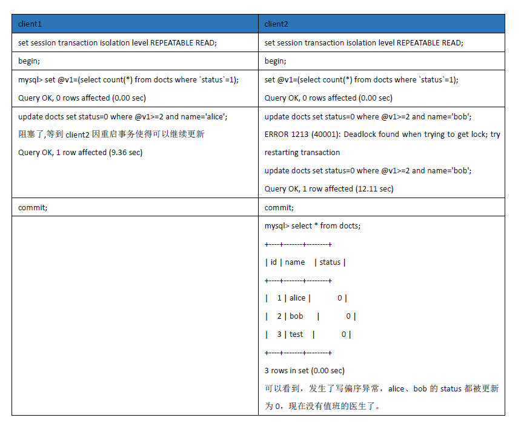
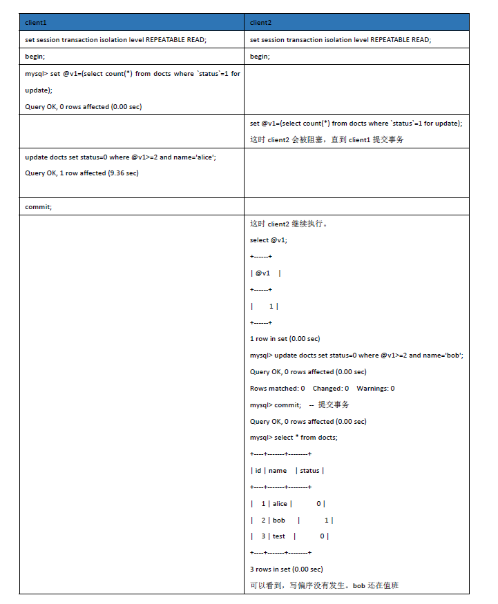

# 概述
数据库系统是现代商业世界有序稳定运行的基石，数据和数据承载的交易事件的结果不会因系统故障而损伤。数据库系统的核心技术是事务处理机制，也是有别于其他系统的关键特质。事务处理机制以其ACID特性保证了在各种环境下的数据一致性。同时：数据库系统又是多用户处理系统，为了提高数据库的性能，数据库常常会并发执行多个事务，事务的并发执行，虽然提高了性能，但是却带来了其他的数据一致性问题，因此，合适的并发控制技术是必须的，本文主要介绍MySQL的事务处理和并发控制技术。  

# 1. 数据库事务系统概述
数据库管理系统是位于用户与操作系统之间的一层数据管理软件，数据库的事务处理机制是数据库的基石，那么为什么需要事务处理机制呢？  

## 1.1 为什么需要事务处理机制
我们先看一个问题：账户A转账50元到账户B，过程如下：  


事务处理机制就是要通过实现事务的ACID特性来保证用户对数据的操作是安全的一致的，不管在什么环境下，都必须是安全的一致的。事务概念为应用程序开发人员提供了一个非常好的抽象，同时保证了数据的安全一致性。  


## 1.2 什么是事务呢？具有哪些特性
前面我们通过例子简单的认识了事务处理的必要性，那么事务到底是什么呢？它的ACID特性该如何理解呢？  

**事务**是数据库管理系统执行过程中的一个逻辑单位，由一个有限的数据库操作序列构成，事务是无法被分割的操作，事务必须作为一个完整的单元成功或失败，不可能存在部分完成的事务。  

**事务具有如下特性：**  
1. 原子性（Atomicity）：事务作为一个整体被执行，包含在其中的对数据库的操作要么全部被执行，要么都不执行。  
2. 一致性（Consistency）：事务应确保数据库的状态从一个一致状态转变为另一个一致状态。一致状态的含义是数据库中的数据应满足完整性约束。  
3. 隔离性（Isolation）：多个事务并发执行时，一个事务的执行不应影响其他事务的执行。   
4. 持久性（Durability）：已被提交的事务对数据库的修改应该永久保存在数据库中。  

**那么该如何理解这四个特性呢？**  
- 1.原子性：ACID的原子性描述了当客户想进行多次写入，但在一些写操作处理完之后出现故障的情况。例如进程崩溃，网络连接中断，磁盘变满或者某种完整性约束被违反。如果这些写操作被分组到一个原子事务中，并且该事务由于错误而不能完成（提交），则该事务将被中止，并且数据库必须丢弃或撤消该事务中迄今为止所做的任何写入。如果没有原子性，在多处更改进行到一半时发生错误，很难知道哪些更改已经生效，哪些没有生效。该应用程序可以再试一次，但冒着进行两次相同变更的风险，可能会导致数据重复或错误的数据。原子性简化了这个问题：如果事务被中止（abort），应用程序可以确定它没有改变任何东西，所以可以安全地重试。ACID原子性的定义特征是：能够在错误时中止事务，丢弃该事务进行的所有写入变更的能力。即：可中止的。  
- 2.一致性：ACID一致性的概念是，对数据的一组特定陈述必须始终成立。例如我们之前举例的转账。一致性更多的强调的是数据库状态的变迁，即：数据库必须从一个有序状态变迁到另一个有序状态，那么什么是有序的? 答案是：**数据在事务的操作下，始终符合用户定义的所有完整性约束**。**可见：原子性，隔离性和持久性是数据库的属性，而一致性（在ACID意义上）是应用程序的属性。应用可能依赖数据库的原子性、隔离性和持久性来实现数据额一致性**。  
- 3.隔离性：大多数数据库都会同时被多个客户端访问。如果它们各自读写数据库的不同部分，这是没有问题的，但是如果它们访问相同的数据库记录，则可能会遇到并发问题（竞争条件（race conditions））。如下图显然违背了隔离性：  
       
ACID意义上的隔离性意味着，同时执行的事务是相互隔离的：它们不能相互冒犯。传统的数据库教科书将隔离性形式化为可串行化（Serializability），这意味着每个事务可以假装它是唯一在整个数据库上运行的事务。数据库确保当事务已经提交时，结果与它们按顺序运行（一个接一个）是一样的，尽管实际上它们可能是并发运行的。不过在实际生产环境中，很少使用可串行化，因为这会使得性能大幅降低。    
- 4.持久性：数据库系统的目的是，提供一个安全的地方存储数据，而不用担心丢失。持久性 是一个承诺，即一旦事务成功完成，即使发生硬件故障或数据库崩溃，写入的任何数据也不会丢失。当然了，没有绝对的持久性，如果你的数据所在的磁盘损坏了呢?备份也损坏了呢？因此没有绝对的持久性安全性，增加副本只能增加安全性的几率，但是绝对达不到100%。  
 
 以上介绍了数据库的四大特性，接下来看看为什么需要并发控制呢？  
 
 ## 1.3 为什么需要并发控制
 我们已经知道，数据库会同时被多个用户（多个事务）访问，如果多个事务访问不同的数据，那么事务之间不会有任何干扰，如果多个事务操作相同的数据，那么各个事务之前就会互相干扰违背事务的隔离性，导致数据不一致。因此，为了满足隔离性，使得各个并发的事务互不干扰，数据库系统必须对并发的事务进行控制，即：并发控制。  
 
 那么不进行并发控制会有哪些问题呢？  
 
 事务之间的关系有如下三种：  
 - 1、读--读：如果多个事务都是只读操作，那么这些事务可以并发，不会互相干扰（因为没有数据更新）。  
 - 2、读--写：如果读写都存在，则会存在脏读、不可重复度、幻读等问题。  
 - 3、写--写：如果多个事务并发的写同一数据，如果不加并发控制也会带来数据异常。  
 
 接下来看看三种常见的读异常：  
  

如上图：  
**脏读**：如果没有并发控制机制，事务T2在Time1处读到了无效的数据（因为事务T1在Time2时中止了）  
**不可重复读**：事务T1在Time3处发生了不可重复读（同一个事务，在事务执行的过程中，同一行数据，读到了不同的值）  
**幻读**：事务T1在Time3处发生了幻读。  

没有并发控制的情况下，读--写操作不仅会造成三种读异常，写写操作也会造成写异常，下边我们看看写-写操作导致的异常：  
  

如上图：
**脏写**：事务T1在time3时刻**回滚**掉了不是自己修改的数据，即事务T1在time3出发生了脏写。    
**丢失更新**：事务T1在time3处**覆盖**掉了不是自己修改的数据，即T1在time3出发生了丢失更新异常，如果是T2在time3时提交，道理也是一样的，只不过在T2上发生了丢失更新。  

除了以上读写异常，还存在一种**语义约束（事务的特性是要保证语义约束的）**引发的数据异常--**写偏序**：为了理解写偏序，我们先看一个例子（该例子来自《数据密集型应用系统设计》一书）：  

 - 你正在为医院写一个医生轮班管理程序。医院通常会同时要求几位医生待命，但底线是至少有一位医生在待命。医生可以放弃他们的班次（例如，如果他们自己生病了），只要至少有一个同事在这一班中继续工作。现在想象一下，Alice和Bob是两位值班医生。两人都感到不适，所以他们都决定请假。不幸的是，他们恰好在同一时间点击按钮下班。下图说明了接下来的事情：  
   

在两个事务中，应用首先检查是否有两个或以上的医生正在值班；如果是的话，它就假定一名医生可以安全地休班。由于两次检查都返回 2 ，所以两个事务都进入下一个阶段。Alice更新自己的记录休班了，而Bob也做了一样的事情。两个事务都成功提交了，现在没有医生值班了。违反了**至少有一名医生在值班（数据库的一致性）**的要求。  

#### 写偏序的特征：  
这种异常称为写偏序。它既不是脏写，也不是丢失更新，因为这两个事务正在更新两个不同的对象（Alice和Bob各自的待命记录）。  

由上可见：如果不进行并发控制，会使得多个并发执行的事务造成各种各样的问题，因此需要并发控制技术。  

**那么是不是只要简单的对各个事务进行排队，并一个接一个的执行就可以了呢？**是的，这样的确可以，但是，这样会使得数据库的性能非常差，为了提高数据库的性能，SQL标准定义了四种隔离级别，这四种隔离级别分别在三种数据读异常前后插入，对应的解决了读异常的发生。  

## 1.4 在正确性和效率之间做权衡
为了提高数据库的效率，同时兼顾正确性，SQL标准定义了四种隔离级别，分别解决各种读数据异常：  
这四种隔离级别如下：  
 - 1 未提交读（READ UNCOMMITTED）：一个事务在执行过程中可以看到其他事务“尚未提交”的修改（包含更新和插入），该隔离级别允许**脏读**，在实际应用中没有实用价值。  
 - 2  已提交读（READ COMMITTED）：一个事务在执行过程中可以看到其他事务“已经提交”的修改（包含更新和插入）。该隔离级别下，允许不可重复读发生，不允许脏读。  
 - 3 可重复性读（REPEATABLE READ）：一个事务在执行过程中可以看到其他事务已经提交的新插入的元组，但是不能看到其他事务对已有元组的更新。允许幻读（范围查询时会出现）。  
 - 4 可串行化（SERIALIZABLE）：看上去就是一个事务接着一个事务的串行执行，不会出现任何不一致。  

实际应用中，已提交读和可重复度比较常用（MySQL默认情况下为可重复性读）。  
**四种隔离级别都不允许脏写和丢失更新发生**。  

# 2 ACID的实现技术
在第一节，学习了数据库的基本概念，特别是事务及其特性，本节梳理一下实现事务和ACID特性的技术。  

## 2.1 实现原子性的技术
1. 事务管理  
```sql
begin;
rollback;
commit;
```
2. 并发控制，避免并发事务之间的干扰  
3. 日志技术  
 - redo日志：用于系统故障发生后的崩溃恢复。  
 - undo日志：用于故障恢复。保证被aborted的事务一定是被aborted的。  
 
## 2.2 实现隔离性的技术
并发控制技术。主要包含：  
1. 加锁    
2. MVCC  

## 2.3 实现 持久性的技术
日志技术
 - 1. redo日志：用于系统故障发生后的崩溃恢复。  
 - 2. undo日志：用于故障恢复。保证被aborted的事务一定是被aborted的。  

# 3 MySQL事务处理
## 3.1 MySQL事务模型
MySQL本质上是一个数据库软件的框架，支持插件化存储引擎，MySQL的事务处理也与具体的存储引擎相关，MySQL只是定义了事务处理的框架具体实现由存储引擎完成。因此MySQL是否支持事务，是与存储引擎相关的。从mysql-5.5.5开始,InnoDB作为默认存储引擎，该存储引擎是支持事务的，同时，InnoDB也是MySQL做为OLTP场景标准的存储引擎，这里主要研究InnoDB的事务模型。  

MySQL的事务管理语句如下：  
```sql
START TRANSACTION
    [transaction_characteristic [, transaction_characteristic] ...]

transaction_characteristic:
    WITH CONSISTENT SNAPSHOT
  | READ WRITE
  | READ ONLY

BEGIN [WORK]
COMMIT [WORK] [AND [NO] CHAIN] [[NO] RELEASE]
ROLLBACK [WORK] [AND [NO] CHAIN] [[NO] RELEASE]
SET autocommit = {0 | 1}
```
 以上这些语句提供了对事务的控制：  

 - START TRANSACTION或BEGIN开始新的事务。  
 - COMMIT 提交当前事务，使其更改持久化。  
 - ROLLBACK 回滚当前事务，取消其更改。  
 - SET autocommit 禁用或启用当前会话的默认自动提交模式。  
  - > 默认情况下，MySQL在启用自动提交模式的情况下运行 。这意味着只要执行更新（修改）语句，MySQL就会将更新存储在磁盘上以使其永久保存。更改无法回滚。即：如果没有显示使用begin开启一个事务，MySQL会隐式开启事务，并自动提交（SQL成功）或回滚（SQL失败）。要为单个sql语句隐式禁用自动提交，请使用以下START TRANSACTION 语句：  
```sql
START TRANSACTION;
SELECT @A:=SUM(salary) FROM table1 WHERE type=1;
UPDATE table2 SET summary=@A WHERE type=1;
COMMIT;
```
mysql看到START TRANSACTION，将会禁用自动提交，直到用COMMIT或者ROLLBACK结束事务，结束之后，自动提交模式将恢复到之前的状态。  

为了要显式禁用自动提交模式，请使用以下语句：  
```sql
SET autocommit=0;
```
通过将autocommit变量设置为零禁用自动提交模式后 ，对事务安全型表（例如InnoDB或NDB表）的更改不会立即生效。你必须使用COMMIT将更改存储到磁盘或ROLLBACK忽略更改。autocommit是一个会话变量，必须为每个会话设置。要为每个新连接禁用自动提交模式，需要修改系统变量。  

一些语句不能回滚。通常包括数据定义语言（DDL）语句。  

MySQL事务有三种提交模式：  
- 1  自动提交；  
- 2 显示执行commit；  
- 3  因执行DDL，触发之前的SQL语句自动提交。  

MySQL事务有三种回滚模式:  
- 1 显示执行rollback；  
- 2  因参数 innodb_lock_wait_timeout (表示锁等待发生多久)事务中的语句进行语句级回滚；  
- 3  因参数innodb_rollback_on_timeout 超时导致整个事务回滚(默认情况下，InnoDB仅回滚事务超时的最后一个语句。如果指定了--innodb-rollback-on-timeout为ON，则事务超时会导致InnoDB回滚整个事务。)  

## 3.2 InnoDB日志技术
日志技术是实现数据库原子性和持久性的核心技术，InnoDB通过UNDO LOG、REDO LOG、doublewrite buffer实现事务的原子性和持久性。  
### 3.2.1 REDO LOG
重做日志是在崩溃恢复期间使用的基于磁盘的数据结构，用于纠正由于写入不完整导致数据错误，从而保证已提交事务的原子性和持久性。  

**为什么需要redo log？**  
为了提高数据库的性能，MySQL 中使用了大量的内存 Cache（Innodb 的buffer poll） ，对数据的修改操作会先修改内存中的 Page，但这些页不会立刻同步磁盘，这时内存中的数据已经和磁盘上的不一致了，我们称这种 Page 为脏页。试想一下这时候如果数据库宕机了，内存中这部分被修改的数据记录就丢失了，重启后也没办法恢复。因此需要redo log，即使数据库不用缓存，也需要使redo log，比如：一个事务写磁盘写了一半，数据库重启了，重启之后数据库根本无法知道事务进行到何种程度了。  

因此为了保证数据的安全性，在修改内存中的 Page 之后 InnoDB 会写 redo log，因为 redo log 是顺序写入的，而众所周知磁盘的顺序读写的速度远大于随机读写，因此这部分日志写操作对性能影响较小。然后，**InnoDB 会在事务提交前将 redo log 保存到磁盘中（可以通过innodb_flush_log_at_trx_commit来控制重做日志刷新到磁盘的策略。该参数默认值为1，表示事务提交必须进行一次fsync操作，还可以设置为0和2。0表示事务提交时不进行写入重做日志操作，该操作只在主线程中完成，2表示提交时写入重做日志，但是只写入文件系统缓存，不进行fsync操作。由此可见，设置为0时，性能最高，但是丧失了事务的一致性）**。这里所说的 redo log 是物理日志而非逻辑日志，记录的是数据页的物理修改（比如：将某个页面的某个偏移量处的值加2），而不是某一行或某几行修改成怎样怎样，它用来恢复提交后的物理数据页（恢复数据页，且只能恢复到最后一次提交的位置）。  

当数据库意外重启时，会根据 redo log 进行数据恢复，如果 redo log 中有事务提交，则进行事务提交修改数据。  

### 3.2.2 UNDO LOG
与 redo log 不同，undo log 一般是逻辑日志，根据每行记录进行记录。例如当 DELETE 一条记录时，undo log 中会记录一条对应的 INSERT 记录，反之亦然当 UPDTAE 一条记录时，它记录一条对应反向 UPDATE 记录。  

当数据被修改时除了会记录 redo log 还会记录 undo log，通过 undo log 一方面可以实现事务回滚，另一方面可以根据 undo log 回溯到某个特定的版本的数据，InnoDB实现 MVCC 的功能时就会用到undo log。  

### 3.2.3 双写（doublewrite buffer）
有了redo log可以用来恢复数据，那么doublewrite buffer是做什么的呢？doublewrite buffer也是用于实现数据的持久性的。  

因为InnoDB并不会将整个页面的内容写入重做日志，而是记录的对页面的操作，例如将某个偏移量处的值加2，使用重做日志进行恢复的基础是表空间中的实际数据页面在内部是完整的一致的，它是哪个页面版本无关紧要 ，但是如果页面不一致，则无法继续恢复，因为你的基础数据就是不一致的。为此引入了Doublewrite Buffer来解决问题。  

但是为什么会出现“表空间的数据页面不完整呢？”  这是因为会出现InnoDB部分页面写入的情况：InnoDB中，在将缓冲池中的数据刷新到磁盘时是以页面（InnoDB的页面，通常为16KB）为单位的，这时可能会出现部分页面写入的问题。所谓部分页面写入是指向操作系统提交的页面写入请求仅部分完成。例如，在16K 的Innodb页面中，只有第一个4KB（文件系统的块通常为4KB）的块被写入磁盘，其他部分保持原来的状态。最常见的部分页面写入一般在发生电源故障时发生。也可能发生在操作系统崩溃时。另外，如果使用软件RAID，页面可能会出现在需要多个IO请求的条带边界上。如果硬件RAID没有电池备份，电源故障时也会发生这种情况。如果对磁盘本身发出单个写入，即使电源掉电，在理论上也应完成写入，因为驱动器内部应该有足够的电源来完成它。但是真的很难检查是否总是这样，因为它不是部分页面写入的唯一原因。  

理解了为什么需要Doublewrite Buffer，也就不难理解Doublewrite Buffer如何工作了。具体来说就是：你可以将**Doublewrite Buffer视为系统表空间中的一个短期日志文件**，它包含100个页的空间。当Innodb从Innodb缓冲池中刷新页面时，InnoDB首先会将页面写入双写缓冲区（顺序），然后调用fsync()以确保它们保存到磁盘，然后将页面写入真正的数据文件并第二次调用fsync()）。现在Innodb恢复的时候会检查表空间中数据页面的内容和Doublewrite Buffer中页面的内容。如果在双写缓冲区中的页面不一致，则简单地丢弃它，如果表空间中的数据页面不一致，则从双写缓冲区中恢复。  


# 4 MySQL并发控制
前面我们已经探讨了需要并发控制技术的原因，本节介绍InnoDB使用的并发控制技术。  
InnoDB的并发控制技术包含两种：  
 - 1 基于锁的并发控制；  
 - 2 MVCC（多版本并发控制）。  
 其中，锁是并发控制的基础，在此基础上实现了MVCC机制，改善了基于锁的方式带来的效率低的问题。使得读写之间互补阻塞，提高了单纯的基于锁的并发效率。  
## 4.1 基于锁的并发
Innodb提供四种粒度的锁：  
 - S：共享锁，也称为读锁；  
 - X：排他锁，也称为写锁；  
 - IS：意向共享锁，也称为意向读锁；  
 - IX：意向排他锁，也称为意向写锁。  

InnoDB锁的想容性矩阵如下：  


InnoDB的加锁机制符合SS2PL（增强两阶段封锁协议），即：  
每个事务分为两个阶段：  
 - 增长阶段：事务只能获得锁，但不能释放锁；  
 - 缩减阶段：事务可以释放锁，但不可获取锁。  
 - 事务提交之前不能释放任何锁。  
不过不同粒度的锁的施加时机和持锁时间与隔离级别和MVCC相关。“串行化”隔离级别下，MVCC不发生作用，InnoDB严格遵循SS2PL。  
可以通过：  
```sql
show status like 'innodb_row_lock%';  
select * from innodb_locks;  -- 5.7即以前
select * from data_locks;  -- 8.0即以前
```
来查看行锁的争用情况。更多信息，可以参考MySQL官方手册。  

### 意向锁作用解读
InnoDB 支持多粒度锁（multiple granularity locking），它允许行级锁与表级锁共存，而意向锁就是其中的一种表锁。  

意向锁分为两种：
意向共享锁（intention shared lock, IS）：事务有意向对表中的某些行加共享锁（S锁）  
```sql
-- 事务要获取某些行的 S 锁，必须先获得表的 IS 锁。
SELECT column FROM table ... LOCK IN SHARE MODE;
```
意向排他锁（intention exclusive lock, IX）：事务有意向对表中的某些行加排他锁（X锁）  
```sql
-- 事务要获取某些行的 X 锁，必须先获得表的 IX 锁。
SELECT column FROM table ... FOR UPDATE;
```
即：**意向锁是有数据引擎自己维护的，用户无法手动操作意向锁，在为数据行加共享/排他锁之前，InooDB 会先获取该数据行所在在数据表的对应意向锁。换言之，数据库引擎看到某表上有事务T持有IX，就可以得知事务T必然持有该表中某些数据行的排他锁。共享锁同理。后面会看到，这个对性能提升意义非凡。**    

意向锁可以提高性能，例如：  
事务 A 获取了某一行的排他锁，并未提交：  
```sql
SELECT * FROM users WHERE id = 6 FOR UPDATE;
```
此时 users 表存在两把锁：users 表上的意向排他锁与 id 为 6 的数据行上的排他锁。  
事务 B 想要获取 users 表的共享锁：  
```sql
LOCK TABLES users READ;
```
此时事务 B 检测事务 A 持有 users 表的意向排他锁，就可以得知事务 A 必然持有该表中某些数据行的排他锁，那么事务 B 对 users 表的加锁请求就会被排斥（阻塞），而无需去检测表中的每一行数据是否存在排他锁(如果是一张大表，这个检查的性能是非常低的)。  

## 4.1.1 锁的种类
InnoDB为了实现基于锁的并发控制，实现了多种类型的锁，包括在聚集索引上实现的行级记录锁，间隙锁，记录锁+间隙锁组合成的范围锁，插入意象锁。这些锁的实现依赖于InnoDB的聚集索引额封锁机制。  

- 1 记录锁：行级锁，依据InnoDB的聚集索引实现，针对索引加的锁。  
- 2 间隙锁：两个索引项之间的间隔称为间隙。把这个间隙视为一个对象，然后在此对象上加锁，就是间隙锁。  
- 3 Next-key lock：由记录锁和此记录前的间隙上的间隙锁组成。用于在重复读的隔离级别下解决幻读问题。    
- 4 插入意象锁：基于间隙锁，专门用于插入操作。目的是为了提高并发度。  

## 4.2 基于MVCC的并发控制
InnoDB在锁的基础上实现了MVCC，增加了并发度。  
概括来说就是当一个事务开始时，它被赋予一个唯一的，永远增长的事务ID（ txid ）。每当事务向数据库写入任何内容时，它所写入的数据都会被标记上写入者的事务ID，一个事务只能看到在他之前提交的事务修改的数据。  

 - 在可重复读的隔离级别下，InnoDB会在第一个select操作时创建一个数据快照。在一致性读（快照读）的查询下，通过快照实现了可重复读，解决了幻读。不过对于非一致性读（当前读）的情况下，需要通过范围锁才能解决幻读。  
 - 对于未提交读和已提交读，事务块内的select会分别创建自己额快照，因此每次读的都不同。后边的select可以读到本次select之前提交的数据。  
 
## 4.3 InnoDB的四种隔离级别
InnoDB实现了四种隔离级别，InnoDB的四种隔离级别的语义除了可重复读之外与标准隔离级别一致。默认情况下为可重复性读，不同之处在于InnoDB的可重复读通过MVCC和范围锁（Next-Key lock）避免了幻读。不同的场景下避免幻读的机制不一样。  
  - 对于SELECT ... FROM   语句，为一致性读（快照读），这种场景下，InnoDB通过MVCC技术，在SELECT的时候创建一个表的一致性快照，该技术下读写不阻塞。  
  - 对于SELECT  ... FROM  FOR UPDATE（当前读--读取的是最新版本, 并且对读取的记录加锁, 不让其他事务同时去改）：则会通过范围锁来实现可重复性读，并且避免幻读。  
 
# 5、隔离级别与数据异常
本节演示一下各种隔离级别下的数据异常。   
分别启动两个客户端client1，client2连接到mysql服务器，client1为主事务端，在此改变隔离级别。  
创建表如下：  
```sql
create table bluesea(c1 int, c2 varchar(32), c3 int, primary key(c1));
```
## 5.1 可串行化隔离级别
  

client2执行insert后，阻塞，这时在client3查看加锁情况如下：
```
mysql> select * from data_locks;
+--------+--------------------------+-----------------------+-----------+----------+---------------+-------------+----------------+-------------------+------------+-----------------------+-----------+-----------+-------------+------------------------+
| ENGINE | ENGINE_LOCK_ID           | ENGINE_TRANSACTION_ID | THREAD_ID | EVENT_ID | OBJECT_SCHEMA | OBJECT_NAME | PARTITION_NAME | SUBPARTITION_NAME | INDEX_NAME | OBJECT_INSTANCE_BEGIN | LOCK_TYPE | LOCK_MODE | LOCK_STATUS | LOCK_DATA              |
+--------+--------------------------+-----------------------+-----------+----------+---------------+-------------+----------------+-------------------+------------+-----------------------+-----------+-----------+-------------+------------------------+
| INNODB | 18262823:7872            |              18262823 |        50 |       18 | test          | bluesea     | NULL           | NULL              | NULL       |       139693811345432 | TABLE     | IX        | GRANTED     | NULL                   |
| INNODB | 18262823:6815:4:1        |              18262823 |        50 |       18 | test          | bluesea     | NULL           | NULL              | PRIMARY    |       139693811342392 | RECORD    | X         | WAITING     | supremum pseudo-record |
| INNODB | 421168866928480:7872     |       421168866928480 |        49 |      209 | test          | bluesea     | NULL           | NULL              | NULL       |       139693811339480 | TABLE     | IS        | GRANTED     | NULL                   |
| INNODB | 421168866928480:6815:4:1 |       421168866928480 |        49 |      209 | test          | bluesea     | NULL           | NULL              | PRIMARY    |       139693811336440 | RECORD    | S         | GRANTED     | supremum pseudo-record |
+--------+--------------------------+-----------------------+-----------+----------+---------------+-------------+----------------+-------------------+------------+-----------------------+-----------+-----------+-------------+------------------------+
4 rows in set (0.00 sec)
```

## 5.2 可重复读隔离级别
不存在幻读  

client2的事务在更新的时候会加锁，client1的不加锁：  
```
select * from data_locks;
+--------+-------------------+-----------------------+-----------+----------+---------------+-------------+----------------+-------------------+------------+-----------------------+-----------+-----------+-------------+-----------+
| ENGINE | ENGINE_LOCK_ID    | ENGINE_TRANSACTION_ID | THREAD_ID | EVENT_ID | OBJECT_SCHEMA | OBJECT_NAME | PARTITION_NAME | SUBPARTITION_NAME | INDEX_NAME | OBJECT_INSTANCE_BEGIN | LOCK_TYPE | LOCK_MODE | LOCK_STATUS | LOCK_DATA |
+--------+-------------------+-----------------------+-----------+----------+---------------+-------------+----------------+-------------------+------------+-----------------------+-----------+-----------+-------------+-----------+
| INNODB | 18262831:7872     |              18262831 |        50 |       24 | test          | bluesea     | NULL           | NULL              | NULL       |       139693811345432 | TABLE     | IX        | GRANTED     | NULL      |
| INNODB | 18262831:6815:4:2 |              18262831 |        50 |       25 | test          | bluesea     | NULL           | NULL              | PRIMARY    |       139693811342392 | RECORD    | X         | GRANTED     | 1         |
+--------+-------------------+-----------------------+-----------+----------+---------------+-------------+----------------+-------------------+------------+-----------------------+-----------+-----------+-------------+-----------+
2 rows in set (0.00 sec)
```
## 5.3 已提交读隔离级别
存在幻读，不可重复读  
  
## 5.4 未提交读隔离级别
存在脏读  
  

## 5.5 写偏序再讨论
写偏序一般遵循如下模式：  
- 1 一个 SELECT 查询找出符合条件的行，并检查是否符合一些要求。（例如：至少有两名医生在值班）。  
- 2  按照第一个查询的结果，应用代码决定是否继续。（可能会继续操作，也可能中止并报错）  
- 3 如果应用决定继续操作，就执行写入（插入、更新或删除），并提交事务。  

这个写入的效果改变了步骤2 中的先决条件。换句话说，如果在提交写入后，重复执行一次步骤1 的SELECT查询，将会得到不同的结果。因为写入改变了符合搜索条件的行集（现在少了一个医生值班） 

MySQL的可重复读避免不了写偏序，为了避免写偏序，需要使用可串行化隔离级别或者在可重复读隔离级别下使用(select ... for update)：  
```sql
BEGIN TRANSACTION;
SELECT count(*) FROM doctors WHERE on_call = TRUE
	AND shift_id = 1234 FOR UPDATE;
UPDATE doctors SET on_call = FALSE
	WHERE name = 'Alice' AND shift_id = 1234;
COMMIT;
```

### 5.5.1 写偏序异常举例
#### 首先构造数据：
我们这里举出的例子还是接着之前的医生值班的例子。  
```sql
CREATE TABLE `docts` (
  `id` int(11) NOT NULL,
  `name` varchar(16) DEFAULT NULL,
  `status` int(11) DEFAULT NULL,
  PRIMARY KEY (`id`)
) ENGINE=InnoDB;
 insert into docts values(1, 'alice', 1);
 insert into docts values(2, 'bob', 1);
 insert into docts values(3, 'test', 0);
mysql> select * from docts;
+----+-------+--------+
| id | name  | status |
+----+-------+--------+
|  1 | alice |      1 |
|  2 | bob   |      1 |
|  3 | test  |      0 |
+----+-------+--------+
3 rows in set (0.00 sec)
select @@transaction_isolation,@@global.transaction_isolation;
+-------------------------+--------------------------------+
| @@transaction_isolation | @@global.transaction_isolation |
+-------------------------+--------------------------------+
| REPEATABLE-READ         | REPEATABLE-READ                |
+-------------------------+--------------------------------+
```
status == 1表示在值班，0表示未值班  

接下来看看在可重复读下写偏序的发生：  
  

```sql
set @v1=(select count(*) from docts where `status`=1 );的加锁情况
mysql> select THREAD_ID, OBJECT_SCHEMA, OBJECT_NAME, LOCK_MODE,LOCK_STATUS from data_locks;
+-----------+---------------+-------------+-----------+-------------+
| THREAD_ID | OBJECT_SCHEMA | OBJECT_NAME | LOCK_MODE | LOCK_STATUS |
+-----------+---------------+-------------+-----------+-------------+
|        49 | test          | docts       | IS        | GRANTED     |
|        49 | test          | docts       | S         | GRANTED     |
|        49 | test          | docts       | S         | GRANTED     |
|        49 | test          | docts       | S         | GRANTED     |
|        49 | test          | docts       | S         | GRANTED     |
+-----------+---------------+-------------+-----------+-------------+
5 rows in set (0.00 sec)
```
### 5.5.2 写偏序异常解决
   

```sql
set @v1=(select count(*) from docts where `status`=1 for update);的加锁情况
mysql> select THREAD_ID, OBJECT_SCHEMA, OBJECT_NAME, LOCK_MODE,LOCK_STATUS from data_locks;
+-----------+---------------+-------------+-----------+-------------+
| THREAD_ID | OBJECT_SCHEMA | OBJECT_NAME | LOCK_MODE | LOCK_STATUS |
+-----------+---------------+-------------+-----------+-------------+
|        49 | test          | docts       | IX        | GRANTED     |
|        49 | test          | docts       | X         | GRANTED     |
|        49 | test          | docts       | X         | GRANTED     |
|        49 | test          | docts       | X         | GRANTED     |
|        49 | test          | docts       | X         | GRANTED     |
+-----------+---------------+-------------+-----------+-------------+
5 rows in set (0.00 sec)
```
