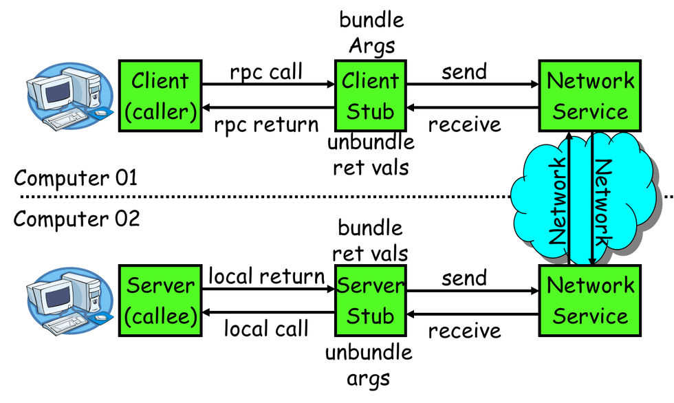

# base theory
现在学习RPC在实现时的基础理论。  
现在随着互联网的发展，服务需要处理的请求越来越多，传统的单机已经无法满足需求，而且互联网业务的特点往往要求服务快速扩容，如此这些特点，使得现在的后台架构越来越复杂。完全从单机演化到分布式系统，分布式系统首先要解决的就是通信问题，RPC通常是构建分布式系统的基石。因此在此学习RPC的理论基础和实现技术。

# 概述
RPC即远程过程调用，为了进一步分析其基础原理，我们先看看一个完整的RPC调用的过程，如下图：  

通过上图，可以看到一次完整的RPC调用流程（同步调用，异步另说）如下： 
1. 服务消费方（client）调用以本地调用方式调用服务；  
2. client stub接收到调用后负责将接口信息、参数等进行序列化，组装成能够进行网络传输的消息体；  
3. client stub找到服务地址，并将消息发送到服务端；  
4. server stub收到消息后进行解码；  
5. server stub根据解码结果调用本地的接口；  
6. 本地服务执行并将结果返回给server stub；  
7. server stub将返回结果打包成消息并发送至消费方；  
8. client stub接收到消息，并进行解码；  
9. 服务消费方（client）得到最终结果。 

RPC框架的目标就是要将2~8这些步骤都封装起来，让用户对这些细节透明。

# rpc需要解决的最基本的问题
如上我们知道，RPC框架的目标就是要将2~8这些步骤都封装起来，让用户对这些细节透明。另外，从图中我们也能看到，client和server不是同一台机器，系统也可以不同，开发语言也可以不同，这些都需要RPC框架进行解决。为此，RPC系统通常有如下三个基本要点：  
1. IDL
2. 消息编解码
3. 网络通信

## 1、IDL

## 2、消息编解码

## 3、网络通信
