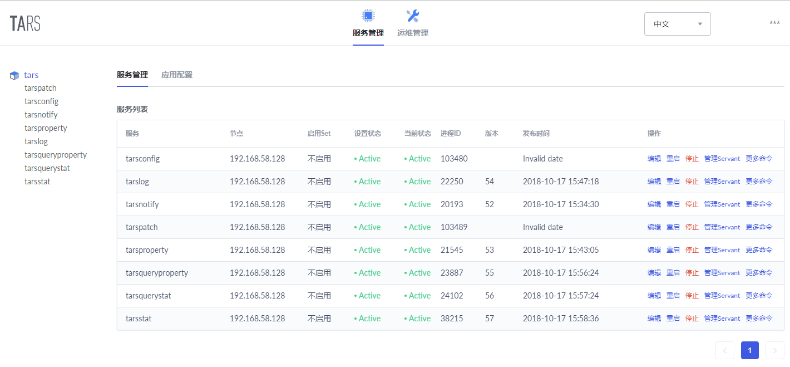

# 1 引言
对于工程师而言，实践是非常重要的一环，因此为了深入学习tars框架，我们先部署tars框架。  

# 2 tars的部署

 - 下载tars: git clone https://github.com/TarsCloud/Tars.git
```
fuboxu@fuboxu-PC3 MINGW64 /f/code/rpc
$ cd ./Tars/

fuboxu@fuboxu-PC3 MINGW64 /f/code/rpc/Tars (master)
$ ll
total 120
drwxr-xr-x 1 fuboxu 1049089     0 十月 13 14:17 build/
-rw-r--r-- 1 fuboxu 1049089  1547 十月 13 14:17 CLA.md
drwxr-xr-x 1 fuboxu 1049089     0 十月 13 14:17 cpp/
drwxr-xr-x 1 fuboxu 1049089     0 十月 13 14:17 deploy/
drwxr-xr-x 1 fuboxu 1049089     0 十月 13 14:17 docs/
drwxr-xr-x 1 fuboxu 1049089     0 十月 13 14:17 docs-en/
drwxr-xr-x 1 fuboxu 1049089     0 十月 13 14:17 framework/
drwxr-xr-x 1 fuboxu 1049089     0 十月 13 14:17 go/
-rw-r--r-- 1 fuboxu 1049089 14323 十月 13 14:17 Install.md
-rw-r--r-- 1 fuboxu 1049089 17043 十月 13 14:17 Install.zh.md
-rw-r--r-- 1 fuboxu 1049089  4738 十月 13 14:17 Install_faq.md
-rw-r--r-- 1 fuboxu 1049089  5679 十月 13 14:17 Install_faq.zh.md
-rw-r--r-- 1 fuboxu 1049089 14337 十月 13 14:17 Introduction.en.md
-rw-r--r-- 1 fuboxu 1049089 14030 十月 13 14:17 Introduction.md
drwxr-xr-x 1 fuboxu 1049089     0 十月 13 14:17 java/
-rw-r--r-- 1 fuboxu 1049089 18511 十月 13 14:17 LICENSE.TXT
drwxr-xr-x 1 fuboxu 1049089     0 十月 13 14:17 nodejs/
drwxr-xr-x 1 fuboxu 1049089     0 十月 13 14:17 php/
-rw-r--r-- 1 fuboxu 1049089  2388 十月 13 14:17 README.md
-rw-r--r-- 1 fuboxu 1049089  2353 十月 13 14:17 README.zh.md
drwxr-xr-x 1 fuboxu 1049089     0 十月 13 14:17 tup/
drwxr-xr-x 1 fuboxu 1049089     0 十月 13 14:17 web/
```
如上tars源码的主要目录如下：  
  
|目录|功能|  
|-|-|   
|framework|C++语言实现的框架基础服务的源码实现|  
|cpp|C++语言框架rpc的源码实现|  
|java|java语言框架rpc的源码实现|  
|go|go语言框架rpc的源码实现|  
|nodejs|nodejs语言框架rpc的源码实现|  
|php|php语言框架rpc的源码实现|  
|tup|tup组包协议各个语言的源码实现|  
|web|管理tars的web源码实现|  

了解了这些目录，我们可以看到，不管你使用哪个语言进行开发，在部署的时候，如下目录必须部署和编译：  
 - framework  
 - cpp  
 - tup  
 - web  

由于go语言现在越来越被大家使用，这里我们除了学习tars的Cpp版本外，也学习并安装go版本。因此，需要安装如下目录：  
 - framework  
 - cpp  
 - tup  
 - web  
 - go  

tars的目的是构建分布式系统，这里为了学习，我们描述在一台服务器上部署tars。  

## 2.1 依赖环境
|软件 |软件要求|  
|-----|--------|
|linux内核版本:      |	2.6.18及以上版本（操作系统依赖）|   
|gcc版本:          	|   4.8.2及以上版本、glibc-devel（c++语言框架依赖）|  
|bison工具版本:      |	2.5及以上版本（c++语言框架依赖）|   
|flex工具版本:       |	2.5及以上版本（c++语言框架依赖）|   
|cmake版本：       	|   2.8.8及以上版本（c++语言框架依赖）|   
|mysql版本:          |   4.1.17及以上版本（框架运行依赖）|  
|rapidjson版本:      |   1.0.2版本（c++语言框架依赖）|   
|nvm版本：           |   0.33.11及以上版本（web管理系统依赖）|   
|node版本：          |   8.11.3及以上版本（web管理系统依赖）|   

对于服务器，只需要一台普通的linux服务器即可。  

### 2.1.1 安装依赖的软件（以centos为例）
yum install glibc-devel  
下载cmake-2.8.8源码包，解压：
tar zxvf cmake-2.8.8.tar.gz  
cd cmake-2.8.8  
./bootstrap  
make  
make install  

--------------------------------------------------------------------------------------------------------------------
然后安装mysql:  

[mysql安装](../../../database/MySQL/MySQLReference/2-installing_and_upgrading_mysql/2-Installing-and-Upgrading-MySQL.md)

安装完之后，配置mysql，这里是个例子：  

```
[mysqld]

# Remove leading # and set to the amount of RAM for the most important data
# cache in MySQL. Start at 70% of total RAM for dedicated server, else 10%.
innodb_buffer_pool_size = 128M

# Remove leading # to turn on a very important data integrity option: logging
# changes to the binary log between backups.
log_bin

# These are commonly set, remove the # and set as required.
basedir = /usr/local/mysql
datadir = /usr/local/mysql/data
# port = .....
# server_id = .....
socket = /tmp/mysql.sock

bind-address={$your machine ip}

# Remove leading # to set options mainly useful for reporting servers.
# The server defaults are faster for transactions and fast SELECTs.
# Adjust sizes as needed, experiment to find the optimal values.
join_buffer_size = 128M
sort_buffer_size = 2M
read_rnd_buffer_size = 2M

sql_mode=NO_ENGINE_SUBSTITUTION,STRICT_TRANS_TABLES
```

这里要注意：bind-address改为部署机器的IP  
然后启动mysql。  
**注意：sql_mode.**  
对于线上的服务，为了高可用，mysql要配置主从复制。具体的可以参考mysql的官方文档。  

--------------------------------------------------------------------------------------------------------------------
**安装node：**  
以官网提供的nvm脚本安装  
执行以下命令：  
wget -qO- https://raw.githubusercontent.com/creationix/nvm/v0.33.11/install.sh | bash  
source ~/.bashrc  
node和带有负载功能的node应用的进程管理器pm2安装  
nvm install v8.11.3  
npm install -g pm2 --registry=https://registry.npm.taobao.org  

---------------------------------------------------------------------------------------------------------
```
很无奈，使用nvm安装node失败了，这里手工安装。
下载node源码包：https://nodejs.org/en/download/  
node-v8.12.0.tar.gz
解压：
tar -zxvf node-v8.12.0.tar.gz
cd ./node-v8.12.0
./configure
make
make install

# 验证安装
[root@localhost node-v8.12.0]# node -v
v8.12.0
[root@localhost node-v8.12.0]# npm -v
6.4.1
[root@localhost node-v8.12.0]#
```
**在这里要特别注意，如果是在虚拟机中，虚拟机连接外网不好，你把源码包下载到了虚拟机的共享文件夹中，由于在共享文件夹中不允许创建符号链接，这时执行./configure将失败，此时你只需要将其拷贝到任何一个非共享文件夹中进行编译安装即可。**  

---------------------------------------------------------------------------------------------------------

## 2.2 tars开发环境安装
安装好tars整个框架依赖的软件之后，就可以安装tars开发环境了。安装之前，先将Tars完整的clone下来。tars包含很多子模块，我们必须完全克隆下来，具体步骤如下：  
```shell
[root@localhost tmp]# git clone https://github.com/TarsCloud/Tars.git
Cloning into 'Tars'...
  remote: Enumerating objects: 6, done.
remote: Counting objects: 100% (6/6), done.
remote: Compressing objects: 100% (5/5), done.
Receiving objects:   7% (551/7434), 492.01 KiB | 242.00 KiB/s   
remote: Total 7434 (delta 1), reused 4 (delta 1), pack-reused 7428
Receiving objects: 100% (7434/7434), 15.17 MiB | 270.00 KiB/s, done.
Resolving deltas: 100% (3784/3784), done.
[root@localhost tmp]#
[root@localhost tmp]# cd ./Tars/
[root@localhost Tars]# git submodule init
Submodule 'cpp' (https://github.com/TarsCloud/TarsCpp) registered for path 'cpp'
Submodule 'framework' (https://github.com/TarsCloud/TarsFramework) registered for path 'framework'
Submodule 'go' (https://github.com/TarsCloud/TarsGo) registered for path 'go'
Submodule 'java' (https://github.com/TarsCloud/TarsJava) registered for path 'java'
Submodule 'nodejs' (https://github.com/tars-node/Tars.js) registered for path 'nodejs'
Submodule 'php' (https://github.com/TarsPHP/TarsPHP) registered for path 'php'
Submodule 'tup' (https://github.com/TarsCloud/TarsTup) registered for path 'tup'
Submodule 'web' (https://github.com/TarsCloud/TarsWeb) registered for path 'web'
[root@localhost Tars]# 
[root@localhost Tars]# git submodule update
Cloning into 'cpp'...
.....
Resolving deltas: 100% (146/146), done.
Submodule path 'cpp': checked out 'ed4727a4843ce79b91e736f30f463d6407a59487'
Cloning into 'framework'...
......
Submodule path 'framework': checked out 'f5406dd2095390c94a6c701406f4363bad381e27'
Cloning into 'go'...
......
Submodule path 'go': checked out '36cf7d196afc781ba8d70f908decbdd7cceccfd3'
Cloning into 'java'...
......
Submodule path 'java': checked out '65fcd05116a0b8bee834529fd890668f35744546'
Cloning into 'nodejs'...
......
Submodule path 'nodejs': checked out 'b40c148d23366f8e24b447058d1a4e3b30f39d90'
Cloning into 'php'...
......
Submodule path 'php': checked out '423a53b654637aaa96f6641c18894c9b9268ee88'
Cloning into 'tup'...
......
Submodule path 'tup': checked out '831fa0ec71c60eb55f3f452544faaaaae39c6c9d'
Cloning into 'web'...
......
Resolving deltas: 100% (2053/2053), done.
Submodule path 'web': checked out '25d5238fd25227f2c8bb29e25163d17a7e8998d6'
[root@localhost Tars]# cd ./framework
[root@localhost framework]# git submodule init
Submodule 'tarscpp' (https://github.com/TarsCloud/TarsCpp.git) registered for path 'tarscpp'
Submodule 'thirdparty/rapidjson' (https://github.com/Tencent/rapidjson.git) registered for path 'thirdparty/rapidjson'
[root@localhost framework]# git submodule update
Cloning into 'tarscpp'...
......
Submodule path 'tarscpp': checked out 'ed4727a4843ce79b91e736f30f463d6407a59487'
Cloning into 'thirdparty/rapidjson'...
......
Submodule path 'thirdparty/rapidjson': checked out '73063f5002612c6bf64fe24f851cd5cc0d83eef9'
[root@localhost framework]# 

``` 
如此，一切都准备就绪，才会将子模块也完全克隆下来，才能进入下一步的安装。  
有关git子模块的信息，见[git子模块](https://git-scm.com/book/zh/v1/Git-%E5%B7%A5%E5%85%B7-%E5%AD%90%E6%A8%A1%E5%9D%97).  

### 2.2.1 C++开发环境安装(CPP核心RPC)
整个框架的运行会依赖于框架的基础服务，这被实现在TarsFramework中，也就是Tars源码目录的framework，是承载TARS各个语言的服务运行的基础框架。同时，framework又依赖于TarsCpp（Tars RPC框架C++语言的源代码），从这里也可以看出，framework其实就是C++语言实现的RPC微服务。TarsCpp对应Tars下的cpp目录和framework下的tarscpp目录(./Tars/cpp和./Tars/framework/tarscpp其实是一样的)。因此，我们先安装TarsFramework，为了安装TarsFramework的基础服务，必须先安装Cpp核心库（因为基础服务依赖于Tars RPC框架C++语言的源代码）。  

 - 如上，我们已经下载好了TarsFramework源码（位于./Tars/framework）。  
 - 进入build cd ./Tars/framework/build.  
 - 执行 ./build.sh prepare (会递归的拉取子模块的代码)  
 - 执行 ./build.sh all （开始编译安装）  

切换至root用户，创建安装目录：  
cd /usr/local  
mkdir tars  
chown xufubo:xufubo ./tars/  

 - 执行 ./build.sh  install（安装）  

如果需要重新编译，请执行：  
 - ./build.sh cleanall
 - ./build.sh all

安装的输出如下：  
```shell
[root@localhost build]# ./build.sh  install
[ 22%] Built target tarsutil
............
[ 98%] Built target tarsqueryproperty
[100%] Built target tarsauth
Install the project...
-- Install configuration: ""
# -- Installing: /usr/local/tars/cpp/lib/libtarsutil.a
-- Installing: /usr/local/tars/cpp/include/util
-- Installing: /usr/local/tars/cpp/include/util/tc_epoller.h
-- Installing: /usr/local/tars/cpp/include/util/tc_callback_detail.h
-- Installing: /usr/local/tars/cpp/include/util/tc_config.h
-- Installing: /usr/local/tars/cpp/include/util/tc_readers_writer_data.h
............
-- Installing: /usr/local/tars/cpp/include/util/tc_sslmgr.h
-- Installing: /usr/local/tars/cpp/include/util/tc_rbtree.h
# -- Installing: /usr/local/tars/cpp/lib/libtarsparse.a
-- Installing: /usr/local/tars/cpp/tools/tars2cpp
......
-- Installing: /usr/local/tars/cpp/tools/pb2tarscpp
-- Installing: /usr/local/tars/cpp/include/servant
-- Installing: /usr/local/tars/cpp/include/servant/Transceiver.h
............
-- Installing: /usr/local/tars/cpp/include/servant/EndpointInfo.h
-- Installing: /usr/local/tars/cpp/include/servant/Message.h
-- Installing: /usr/local/tars/cpp/include/tup
-- Installing: /usr/local/tars/cpp/include/tup/RequestF.tars
-- Installing: /usr/local/tars/cpp/include/jmem
-- Installing: /usr/local/tars/cpp/include/jmem/jmem_hashmap.h
-- Installing: /usr/local/tars/cpp/include/jmem/jmem_queue.h
-- Installing: /usr/local/tars/cpp/include/promise
-- Installing: /usr/local/tars/cpp/include/promise/promise.h
......
-- Installing: /usr/local/tars/cpp/include/promise/tuple.h
-- Installing: /usr/local/tars/cpp/./script
-- Installing: /usr/local/tars/cpp/./script/create_tars_server.sh
......
-- Installing: /usr/local/tars/cpp/./script/demo/DemoServer.h
-- Installing: /usr/local/tars/cpp/./makefile
-- Installing: /usr/local/tars/cpp/./makefile/makefile.tars
-- Installing: /home/tarsproto/protocol/AdminF.tars
-- Installing: /home/tarsproto/protocol/AdminF.h
..........
-- Installing: /home/tarsproto/protocol/StatF.h
# -- Installing: /usr/local/tars/cpp/lib/libtarsservant.a
[root@localhost build]# 
```
默认的安装路径为/usr/local/tars/cpp。  

如要修改安装路径：  
 - 需要修改tarscpp目录下CMakeLists.txt文件中的安装路径。  
 - 需要修改tarscpp/servant/makefile/makefile.tars文件中的TARS_PATH的路径  
 - 需要修改tarscpp/servant/script/create_tars_server.sh文件中的DEMO_PATH的路径   

**CPP RPC实现安装心得：腾讯官方发布的源码编译不过，在连接的时候会有如下错误：**  
```shell
......
/usr/local/mysql/lib/libmysqlclient.a(viossl.cc.o): In function `ssl_do(st_VioSSLFd*, Vio*, long, int (*)(ssl_st*), unsigned long*)':
viossl.cc:(.text._ZL6ssl_doP11st_VioSSLFdP3ViolPFiP6ssl_stEPm+0x26): undefined reference to `SSL_new'
........
/usr/local/mysql/lib/libmysqlclient.a(viossl.cc.o): In function `vio_ssl_write(Vio*, unsigned char const*, unsigned long)':
viossl.cc:(.text._Z13vio_ssl_writeP3VioPKhm+0x6c): undefined reference to `SSL_write'
/usr/local/mysql/lib/libmysqlclient.a(viossl.cc.o): In function `vio_ssl_shutdown(Vio*)':
.......
my_aes_openssl.cc:(.text._Z14my_aes_decryptPKhjPhS0_j13my_aes_opmodeS0_b+0xfa): undefined reference to `EVP_DecryptFinal_ex'
my_aes_openssl.cc:(.text._Z14my_aes_decryptPKhjPhS0_j13my_aes_opmodeS0_b+0x106): undefined reference to `EVP_CIPHER_CTX_cleanup'
my_aes_openssl.cc:(.text._Z14my_aes_decryptPKhjPhS0_j13my_aes_opmodeS0_b+0x141): undefined reference to `ERR_clear_error'
/usr/local/mysql/lib/libmysqlclient.a(my_aes_openssl.cc.o): In function `my_aes_get_size(unsigned int, my_aes_opmode)':
........
/usr/local/mysql/lib/libmysqlclient.a(sha2_password_common.cc.o): In function `sha2_password::SHA256_digest::deinit()':
sha2_password_common.cc:(.text._ZN13sha2_password13SHA256_digest6deinitEv+0x16): undefined reference to `EVP_MD_CTX_destroy'
collect2: error: ld returned 1 exit status
make[2]: *** [deploy/tarsconfig/bin/tarsconfig] Error 1
make[1]: *** [ConfigServer/CMakeFiles/tarsconfig.dir/all] Error 2
```
一开始，我以为是系统openssl没有安装，所以连接不到openssl的库（collect2: error: ld returned 1 exit status），后来排查之后发现安装了openssl，那就说明是cmake在生成makefile的时候，没有连接openssl的库，就去检查cmake，发现tars定义了个变量：set(TARS_SSL 0)，随后会依据这个做判断：  
```
if(${TARS_SSL} EQUAL 1)
    target_link_libraries(tarsutil; crypto; ssl)
else()
    target_link_libraries(tarsutil)
endif()
```
```
if(${TARS_SSL} EQUAL 1)
    target_link_libraries(tarsservant; crypto; ssl)
else() 
    target_link_libraries(tarsservant)
endif()
```
tars依赖的mysql的客户端库，mysql需要连接openssl库，因此，如果把TARS_SSL设置为0，在编译可执行文件时，连接mysql客户短端库就会因为找不到ssl库而出错，因此需要将TARS_SSL设置为1.   

**接下来看看安装tars cpp后的路径布局吧：**   
```shell
[root@localhost tars]# pwd
/usr/local/tars
[root@localhost tars]# ls
cpp
[root@localhost tars]# cd ./cpp/
[root@localhost cpp]# ls
include  lib  makefile  script  tools
[root@localhost cpp]# ll ./include/
total 20
drwxr-xr-x. 2 root root 4096 Oct 13 20:03 jmem
drwxr-xr-x. 2 root root 4096 Oct 13 20:03 promise
drwxr-xr-x. 2 root root 4096 Oct 13 20:03 servant
drwxr-xr-x. 2 root root 4096 Oct 13 20:03 tup
drwxr-xr-x. 3 root root 4096 Oct 13 20:03 util
[root@localhost cpp]# ll ./lib/
total 108116
-rw-r--r--. 1 root root  6031932 Oct 13 19:55 libtarsparse.a
-rw-r--r--. 1 root root 76743948 Oct 13 19:56 libtarsservant.a
-rw-r--r--. 1 root root 27929548 Oct 13 19:34 libtarsutil.a
[root@localhost cpp]# ll ./makefile/
total 8
-rw-r--r--. 1 root root 6721 Oct 13 19:24 makefile.tars
[root@localhost cpp]# ll ./script/
total 16
-rw-r--r--. 1 root root  879 Oct 13 19:24 create_http_server.sh
-rw-r--r--. 1 root root  891 Oct 13 19:24 create_tars_server.sh
drwxr-xr-x. 2 root root 4096 Oct 13 20:03 demo
drwxr-xr-x. 2 root root 4096 Oct 13 20:03 http_demo
[root@localhost cpp]# ll ./tools/
total 42668
-rwxr-xr-x. 1 root root 2372480 Oct 13 19:35 pb2tarscpp
-rwxr-xr-x. 1 root root 5973512 Oct 13 19:55 tars2android
-rwxr-xr-x. 1 root root 3860336 Oct 13 19:55 tars2c
-rwxr-xr-x. 1 root root 6907592 Oct 13 19:55 tars2cpp
-rwxr-xr-x. 1 root root 3936296 Oct 13 19:55 tars2cs
-rwxr-xr-x. 1 root root 9167936 Oct 13 19:55 tars2node
-rwxr-xr-x. 1 root root 3750616 Oct 13 19:55 tars2oc
-rwxr-xr-x. 1 root root 3773512 Oct 13 19:55 tars2php
-rwxr-xr-x. 1 root root 3926824 Oct 13 19:55 tars2python
[root@localhost cpp]# 
```
各个目录中的内容如下：  
 - include为CPP头文件，后续将要安装的基础服务、给予CPP的开发都要包含这些头文件。  
 - lib：其中包含libtarsparse.a  libtarsservant.a  libtarsutil.a，它们分别是  
  - > libtarsparse.a：将tars文件翻译成具体语言文件的工具依赖的库，主要是tars文件的词法分析，语法分析等。   
  - > libtarsservant.a：tars RPC CPP实现的核心，最核心的就是网络通信的实现和管理，后续的CPP RPC服务需要连接该库。     
  - > libtarsutil.a：基础库，CPP实现依赖该库，后续如果选择CPP进行业务开发，也会依赖该库。  
 - makefile：包含一个很大的makefile，我们在开发的时候，需要包含这个基础makefile
 - script：demo和自动创建代码的脚本create_http_server.sh，create_tars_server.sh
 - tools：将tars协议文件翻译成各种语言文件的工具。  

### 2.2.2 Tars数据库环境初始化
上一节安装了CPP RPC实现，以及各种IDL（接口描述语言）工具，为了框架的运行，还需要很多基础服务，例如：服务治理，配置管理，监控上报等等这些承载TARS各个语言的服务运行的基础服务。接下来描述这些服务的安装和部署，这些服务的运行会基于数据库服务，接下来先介绍数据库的配置和初始化。  

对于分布式框架而言，本身的稳定是非常重要的，数据更加重要，因此做好备份是非常重要的，这里我们使用mysql数据库服务器，在这里先配置mysql的主从复制，更加详细的原理可以参考mysql官网，这里只提供配置好的配置文件内容：  
**master**
```
[mysqld]
innodb_buffer_pool_size = 128M
basedir = /usr/local/mysql
datadir = /usr/local/mysql/data
socket = /tmp/mysql.sock

bind-address=*
join_buffer_size = 128M
sort_buffer_size = 2M
read_rnd_buffer_size = 2M
sql_mode=NO_ENGINE_SUBSTITUTION,STRICT_TRANS_TABLES

# 以下为复制配置
log-bin=mysql-bin
server_id=6
innodb_flush_log_at_trx_commit=1  # 非常重要
sync_binlog=1     # 对于复制来说非常重要
```

**slave**
```
[mysqld]
innodb_buffer_pool_size = 128M
basedir = /usr/local/mysql
datadir = /usr/local/mysql/data
socket = /tmp/mysql.sock

bind-address=*
join_buffer_size = 128M
sort_buffer_size = 2M
read_rnd_buffer_size = 2M
sql_mode=NO_ENGINE_SUBSTITUTION,STRICT_TRANS_TABLES

# 以下为复制配置
log-bin=mysql-bin
server_id=8
relay_log=/usr/local/mysql/data/mysql-relay-bin
log_slave_updates=1
```

配置好主从之后，重启mysql数据库服务器，开始进行复制。  

---------------------------------------------------------------------------------------------------------------
如果在虚拟机配置主从复制的时候出现了如下错误：  
```shell
[root@localhost mysql]# mysql -h 192.168.58.130 -P3306 -uroot -p
Enter password: 
ERROR 2003 (HY000): Can't connect to MySQL server on '192.168.58.130' (113)
需要禁止防火墙：  
[root@localhost xufubo]# firewall-cmd --state    #看看状态
running
[root@localhost xufubo]# systemctl stop firewalld.service  # 停止
[root@localhost ~]#firewall-cmd --state   
not running
[root@localhost ~]#systemctl disable firewalld.service #禁止firewall开机启动

小结一下centos7：  
启动一个服务：systemctl start firewalld.service
关闭一个服务：systemctl stop firewalld.service
重启一个服务：systemctl restart firewalld.service
显示一个服务的状态：systemctl status firewalld.service
在开机时启用一个服务：systemctl enable firewalld.service
在开机时禁用一个服务：systemctl disable firewalld.service
查看服务是否开机启动：systemctl is-enabled firewalld.service;echo $?
查看已启动的服务列表：systemctl list-unit-files|grep enabled
```
如上，关闭防火墙之后就可以远程连接mysql了。

---------------------------------------------------------------------------------------------------------------

在主站上创建复制账户：(这里的密码为了好记，真实密码不可这么简单)  
```sql
mysql> CREATE USER 'mysql-sync'@'%' IDENTIFIED BY 'mysql';
Query OK, 0 rows affected (0.09 sec)

mysql> GRANT REPLICATION SLAVE ON *.* TO 'mysql-sync'@'%';
Query OK, 0 rows affected (0.06 sec)
```
在从站上启动复制：  
```sql
# 看看master位置：  
mysql> show master status \G;
*************************** 1. row ***************************
             File: mysql-bin.000002
         Position: 3048
     Binlog_Do_DB: 
 Binlog_Ignore_DB: 
Executed_Gtid_Set: 
1 row in set (0.00 sec)

mysql> CHANGE MASTER TO
       MASTER_HOST='192.168.58.128',
       MASTER_USER='mysql-sync',
       MASTER_PASSWORD='mysql',
       MASTER_LOG_FILE='mysql-bin.000002',
       MASTER_LOG_POS=3048,
       MASTER_SSL = 1;
Query OK, 0 rows affected, 2 warnings (0.12 sec)

mysql> 
mysql> 
mysql> start slave;
mysql> show slave status \G;
*************************** 1. row ***************************
               Slave_IO_State: Waiting for master to send event
                  Master_Host: 192.168.58.128
                  Master_User: mysql-sync
                  Master_Port: 3306
                Connect_Retry: 60
              Master_Log_File: mysql-bin.000002
          Read_Master_Log_Pos: 3048
               Relay_Log_File: mysql-relay-bin.000002
                Relay_Log_Pos: 322
        Relay_Master_Log_File: mysql-bin.000002
             Slave_IO_Running: Yes
            Slave_SQL_Running: Yes
              Replicate_Do_DB: 
          Replicate_Ignore_DB: 
......
```
-----------------------------------------------------------------------------------------------------------------------
这时，在master上的操作就会复制到从机上。   

**注意：在设置slave时要使用MASTER_SSL = 1，否则会出现slave连接master失败的情况。**  
**为了使通过caching_sha2_password插件进行身份验证的用户帐户连接到主站，你必须按照[Section 17.3.9 Setting Up Replication to Use Encrypted Connections](https://dev.mysql.com/doc/refman/8.0/en/replication-solutions-encrypted-connections.html)**   

配置好主从复制之后，开始初始化框架运行基础服务的数据：  

#### 2.2.2.1 添加用户
```sql
create user 'tars'@'%' identified by 'tars2015';
grant all on *.* to 'tars'@'%';
create user 'tars'@'localhost' identified by 'tars2015';
grant all on *.* to 'tars'@'localhost';
flush privileges;
```
{主机名}要换成自己的ip。  

#### 2.2.2.2 创建数据库
sql脚本在framework/sql目录下，修改部署的ip信息
```shell
sed -i "s/192.168.2.131/${your machine ip}/g" `grep 192.168.2.131 -rl ./*`  
sed -i "s/db.tars.com/${your machine ip}/g" `grep db.tars.com -rl ./*`  
```
注意，192.168.2.131这个ip是tars开发团队当时部署服务测试的ip信息，替换成自己数据库的部署地址即可,不要是127.0.0.1   
注意，db.tars.com是tars框架数据库部署的地址信息，替换成自己数据库的部署地址即可   

即：  
```shell
sed -i "s/192.168.2.131/192.168.58.128/g" `grep 192.168.2.131 -rl ./*`
设置：db.tars.com  
[root@localhost sql]# vi /etc/hosts
192.168.58.128  db.tars.com
主从切换的时候，可以将db.tars.com路由到mysql从机192.168.58.130  
```
执行:  
```shell
chmod u+x exec-sql.sh
./exec-sql.sh
```
如果exec-sql.sh脚本执行出错，需要脚本里修改数据库用户名root对应的密码.  
脚本执行后，会创建3个数据库，分别是db_tars、tars_stat、tars_property。  
 - db_tars：框架运行依赖的核心数据库，里面包括了服务部署信息、服务模版信息、服务配置信息等等；  
 - tars_stat：框架为了支持高可用做了很多统计上报（例如超时，异常等等），该库存储服务监控数据的数据库；   
 - tars_property：框架为了支持高可用做了很多属性监控，该库存储服务属性监控数据的数据库；  
 - db_tars_web：**还不知道是干什么的，可以确定是web管理端需要，具体功能需要认真研究后确定**。  

这时候，主机、从机完全一致：  
```
+--------------------+
| Database           |
+--------------------+
| db_tars            |
| db_tars_web        |
| information_schema |
| mysql              |
| performance_schema |
| sys                |
| tars_property      |
| tars_stat          |
| test               |
+--------------------+
9 rows in set (0.00 sec)
```
### 2.2.3 Tars框架运行环境搭建(部署框架运行的基础服务)
先看看框架的基础服务：  
```shell
[root@localhost framework]# pwd
/tmp/Tars/framework
[root@localhost framework]# ll
drwxr-xr-x.  2 root root 4096 Oct 13 19:24 AdminRegistryServer
drwxr-xr-x.  2 root root 4096 Oct 13 19:24 AuthServer
drwxr-xr-x. 18 root root 4096 Oct 13 20:03 build
-rw-r--r--.  1 root root 6613 Oct 13 19:24 CMakeLists.txt
drwxr-xr-x.  2 root root 4096 Oct 13 19:24 conf
drwxr-xr-x.  2 root root 4096 Oct 13 19:24 ConfigServer
drwxr-xr-x. 14 root root 4096 Oct 13 19:24 deploy
drwxr-xr-x.  3 root root 4096 Oct 13 19:24 docs
drwxr-xr-x.  2 root root 4096 Oct 13 19:24 docs-en
drwxr-xr-x.  2 root root 4096 Oct 13 19:24 LogServer
drwxr-xr-x.  2 root root 4096 Oct 13 19:24 NodeServer
drwxr-xr-x.  2 root root 4096 Oct 13 19:24 NotifyServer
drwxr-xr-x.  2 root root 4096 Oct 13 19:24 patchclient
drwxr-xr-x.  2 root root 4096 Oct 13 19:24 PatchServer
drwxr-xr-x.  2 root root 4096 Oct 13 19:24 PropertyServer
drwxr-xr-x.  2 root root 4096 Oct 13 19:24 QueryPropertyServer
drwxr-xr-x.  2 root root 4096 Oct 13 19:24 QueryStatServer
-rw-r--r--.  1 root root 1160 Oct 13 19:24 README.md
-rw-r--r--.  1 root root  903 Oct 13 19:24 README.zh.md
drwxr-xr-x.  2 root root 4096 Oct 13 19:24 RegistryServer
drwxr-xr-x.  2 root root 4096 Oct 13 19:24 sql
drwxr-xr-x.  2 root root 4096 Oct 13 19:24 StatServer
drwxr-xr-x.  9 root root 4096 Oct 13 19:33 tarscpp
drwxr-xr-x.  3 root root 4096 Oct 13 19:24 thirdparty
```
核心服务如下：  
  
|目录名称|功能|     
|-|-|  
|sql|创建TARS框架运行环境的数据库的脚本和sql工具|   
|conf|各个基础服务的模版配置|   
|protocol|定义各个基础服务定义的通信接口文件|   
|RegistryServer|名字服务路由|   
|NodeServer|管理服务|   
|AdminRegistryServer|与前台进行交互的接入管理服务|   
|PatchServer|发布服务|   
|ConfigServer|配置服务|   
|LogServer|日志服务|   
|StatServer|模调数据统计服务|   
|PropertyServer|属性统计服务|   
|NotifyServer|异常上报统计服务|   
|deploy|核心基础服务的模版配置和工具脚本|   
|tarscpp|Tars RPC框架C++语言的源代实现|   
  
框架服务的安装分两种：  
一种是核心基础服务(必须的)，必须手工部署的，  
一种是普通基础服务(可选的)，可以通过管理平台发布的(和普通服务一样）。  
 - 手工部署的核心基础服务：tarsAdminRegistry, tarsregistry, tarsnode, tarsconfig, tarspatch  
 - 通过管理平台部署的普通基础服务：tarsstat, tarsproperty,tarsnotify, tarslog，tarsquerystat，tarsqueryproperty  

首先准备第一种服务的安装包(之前已经编译了)，在build/目录下输入：  
```shell
make framework-tar
```
会在当前目录生成framework.tgz 包 这个包包含了 tarsAdminRegistry, tarsregistry, tarsnode, tarsconfig, tarspatch 部署相关的文件  

第二种服务安装包可以单独准备：  
```shell
make tarsstat-tar
make tarsnotify-tar
make tarsproperty-tar
make tarslog-tar
make tarsquerystat-tar
make tarsqueryproperty-tar
```
生成的发布包，在管理平台部署发布完成后，进行部署发布,本文后边会讲。  

*注意在管理平台进行部署时，选择正确的服务模板即可（默认是有的，若没有相应的模版，可以在管理平台上创建，具体服务的模版内容可以tars_template.md）!*   
```shell
[root@localhost build]# ll
total 76928
.....
-rw-r--r--.  1 root root 78579538 Oct 14 17:10 framework.tgz
......
drwxr-xr-x.  3 root root     4096 Oct 13 19:55 LogServer

[root@localhost build]# tar -zxvf framework.tgz
drwxr-xr-x.  5 root root     4096 Oct 14 17:10 tarsAdminRegistry
drwxr-xr-x.  5 root root     4096 Oct 14 17:10 tarsconfig
-rw-r--r--.  1 root root      722 Oct 14 17:10 tars_install.sh
drwxr-xr-x.  5 root root     4096 Oct 14 17:10 tarsnode
-rw-r--r--.  1 root root      450 Oct 14 17:10 tarsnode_install.sh
drwxr-xr-x.  5 root root     4096 Oct 14 17:10 tarspatch
drwxr-xr-x.  5 root root     4096 Oct 14 17:10 tarsregistry

```
**打包之后，安装核心基础服务**  
```shell
[root@localhost tars]# cd /usr/local/
[root@localhost local]# mkdir app
[root@localhost local]# cd ./app/
[root@localhost app]# mkdir tars
[root@localhost app]# chown xufubo:xufubo ./tars/
[root@localhost app]# cp /tmp/Tars/framework/build/framework.tgz ./tars/
[root@localhost app]# 
[root@localhost app]# cd ./tars/
[root@localhost tars]# ll
total 76740
-rw-r--r--. 1 root root 78579538 Oct 14 17:18 framework.tgz
[root@localhost tars]# tar xzfv framework.tgz
[root@localhost tars]# ll
total 76768
-rw-r--r--. 1 root root 78579538 Oct 14 17:18 framework.tgz
drwxr-xr-x. 5 root root     4096 Oct 14 17:10 tarsAdminRegistry
drwxr-xr-x. 5 root root     4096 Oct 14 17:10 tarsconfig
-rw-r--r--. 1 root root      722 Oct 14 17:10 tars_install.sh
drwxr-xr-x. 5 root root     4096 Oct 14 17:10 tarsnode
-rw-r--r--. 1 root root      450 Oct 14 17:10 tarsnode_install.sh
drwxr-xr-x. 5 root root     4096 Oct 14 17:10 tarspatch
drwxr-xr-x. 5 root root     4096 Oct 14 17:10 tarsregistry
[root@localhost tars]# 
```
修改各个服务对应conf目录下配置文件，注意将配置文件中的ip地址修改为本机ip地址，如下：  
cd /usr/local/app/tars
sed -i "s/192.168.2.131/${your_machine_ip}/g" `grep 192.168.2.131 -rl ./*`  
sed -i "s/db.tars.com/${your_machine_ip}/g" `grep db.tars.com -rl ./*`  
sed -i "s/registry.tars.com/${your_machine_ip}/g" `grep registry.tars.com -rl ./*`  
sed -i "s/web.tars.com/${your_machine_ip}/g" `grep web.tars.com -rl ./*`  

192.168.2.131这个ip是tars开发团队当时部署服务测试的ip信息，替换成本机的部署地址即可，不要是127.0.0.1   
db.tars.com是tars框架数据库部署的地址信息，替换成自己数据库的部署地址即可  
registry.tars.com是tars框架主控tarsregistry服务部署的地址信息，替换成自己主控tarsregistry符的部署地址即可  
web.tars.com是rsync使用的地址信息，替换成自己的部署机器地址即可  

由于我们之前在/etc/hosts配置了db.tars.com。因此这里我们也不替换，这样也方便mysql主备切换。  
```shell
cd /usr/local/app/tars
vi /etc/hosts
然后添加：  
192.168.58.128 web.tars.com
192.168.58.128 registry.tars.com
sed -i "s/192.168.2.131/192.168.58.128/g" `grep 192.168.2.131 -rl ./*`
```

然后在/usr/local/app/tars/目录下，执行脚本，启动tars框架服务  
chmod u+x tars_install.sh  
./tars_install.sh  
注意如果几个服务不是部署在同一台服务器上，需要自己手工copy以及处理tars_install.sh脚本  


部署管理平台并启动web管理平台(管理平台必须和tarspatch部署在同一台服务器上)部署tarspatch，切换至root用户，并执行  
tarspatch/util/init.sh  
**注意，上面脚本执行后，看看rsync进程是否起来了，若没有看看rsync使用的配置中的ip是否正确（即把web.tars.com替换成本机ip）  
在管理平台上面配置tarspatch，注意需要配置服务的可执行目录(/usr/local/app/tars/tarspatch/bin/tarspatch)  
在管理平台上面配置tarsconfig，注意需要配置服务的可执行目录(/usr/local/app/tars/tarsconfig/bin/tarsconfig)  
tarsnode需要配置监控，避免不小心挂了以后会启动，需要在crontab里面配置  
```shell
* * * * * /usr/local/app/tars/tarsnode/util/monitor.sh   
 ```


### 2.2.4 特殊基础服务--tarsnode
核心基础服务的安装成功后，如果需要在其他机器也能部署基于tars框架的服务，那么在管理平台扩容部署前，需要安装tarsnode服务。  
如果只是在一台机器部署服务进行测试，这一步可以先忽略，等到需要扩容时再执行。  

具体步骤跟上一节很像，如下：  

切换至root用户，创建基础服务的部署目录，如下：  
```shell
cd /usr/local/app   
mkdir tars   
chown xufubo:xufubo ./tars/   
```
将已打好的框架服务包复制到/usr/local/app/tars/，然后解压，如下：   
```shell
cp build/framework.tgz /usr/local/app/tars/
cd /usr/local/app/tars
tar xzfv framework.tgz
```
修改各个服务对应conf目录下配置文件，注意将配置文件中的ip地址修改为本机ip地址，如下：
```shell
cd /usr/local/app/tars
sed -i "s/192.168.2.131/${your_machine_ip}/g" `grep 192.168.2.131 -rl ./*`
sed -i "s/db.tars.com/${your_machine_ip}/g" `grep db.tars.com -rl ./*`
sed -i "s/registry.tars.com/${your_machine_ip}/g" `grep registry.tars.com -rl ./*`
sed -i "s/web.tars.com/${your_machine_ip}/g" `grep web.tars.com -rl ./*`
```
192.168.2.131这个ip是tars开发团队当时测试的ip信息，替换成自己扩容机器的ip地址即可，不要是127.0.0.1   
db.tars.com是tars框架数据库部署的地址信息，替换成数据库的部署ip地址即可   
registry.tars.com是tars框架主控tarsregistry服务部署的地址信息，替换成自己主控tarsregistry的部署地址即可   
web.tars.com是rsync使用的地址信息，替换成web的部署机器地址即可    
这一步是否通过sed替换，以及替换什么，取决于我们的真实环境，例如上边我们就没有去按照这个标准去替换这些ip、主机名等，而是选择了配置/etc/hosts。  

然后在/usr/local/app/tars/目录下，执行脚本，启动tars框架服务  
```shell
chmod u+x tarsnode_install.sh
./tarsnode_install.sh
```
配置监控，避免不小心挂了以后会启动，需要在crontab里面配置   
```shell
* * * * * /usr/local/app/tars/tarsnode/util/monitor.sh   
```

**由于我只在一台机器上部署的tars框架，因此，这一步不需要进行**
------------------------------------------------------------------------------------------------------------------

### 2.2.5 安装web管理系统   
**管理系统源代码目录名称为web**
以linux环境为例：

 - 以官网提供的nvm脚本安装   
  > 执行以下命令：
```shell
wget -qO- https://raw.githubusercontent.com/creationix/nvm/v0.33.11/install.sh | bash
source ~/.bashrc
 # node和带有负载功能的node应用的进程管理器pm2安装
nvm install v8.11.3
# 我在执行nvm install v8.11.3的时候一直失败，因此采用了源码安装。   
# 安装pm2(管理node进程的工具。我们需要使用)  
# 安装pm2的时候也是一直失败，后来是使用了腾讯的源才成功的，因此这里的安装要依据具体环境而做调整。  
npm install -g pm2 --registry=https://registry.npm.taobao.org
```

 > 修改配置：  
```shell
cd web
sed -i 's/db.tars.com/${your_machine_ip}/g' config/webConf.js
sed -i 's/registry.tars.com/${your_machine_ip}/g' config/tars.conf
# 这里也要依据你的安装环境来确定是否替换，由于我之前配置了/etc/hosts，因此这里不做任何改变。  
```
 > 创建web管理端需要的表：   
```shell
cd ./web/sql
mysql -uroot -pmysql db_tars_web < ./db_tars_web.sql
# 密码视情况改成自己的。
```
 > 安装web管理端并启动：  
```shell
cd web
npm install --registry=https://registry.npm.taobao.org
npm run prd
```
*这里我浪费了不少时间，主要是有些模块没有安装导致的，这些模块缺失的时候，npm run prd没有给出提示，只是提示：*
```shell
PM2        | 2018-10-17 11:37:22: Starting execution sequence in -fork mode- for app name:tars-node-web id:0
PM2        | 2018-10-17 11:37:22: App name:tars-node-web id:0 online
PM2        | 2018-10-17 11:37:22: App [tars-node-web] with id [0] and pid [101699], exited with code [1] via signal [SIGINT]
PM2        | 2018-10-17 11:37:22: Script /tmp/Tars/web/bin/www had too many unstable restarts (16). Stopped. "errored"
```
*查了很多资料无果，后来直接使用node启动app.js, node ./app.js。这时node就会提示哪些模块缺失了，安装完这些模块之后，再次使用npm run prd，启动成功了。*    

web管理端就部署完成了。    

### 2.2.6 部署普通基础服务
在浏览器输入 http://192.168.58.128:3000 进行部署。这个管理页面很简单，怎么使用就不做详细说明了。  

发布完成之后进程如下：  
```shell
[root@localhost Tars]# ps aux | grep tars
root      20193  0.1  3.6 960492 69068 ?        Sl   15:35   0:02 /usr/local/app/tars/tarsnode/data/tars.tarsnotify/bin/tarsnotify --config=/usr/local/app/tars/tarsnode/data/tars.tarsnotify/conf/tars.tarsnotify.config.conf
root      21545  0.2  4.1 1268140 77932 ?       Sl   15:43   0:02 /usr/local/app/tars/tarsnode/data/tars.tarsproperty/bin/tarsproperty --config=/usr/local/app/tars/tarsnode/data/tars.tarsproperty/conf/tars.tarproperty.config.conf
root      22250  0.7  0.7 1715108 13420 ?       Sl   15:47   0:04 /usr/local/app/tars/tarsnode/data/tars.tarslog/bin/tarslog --config=/usr/local/app/tars/tarsnode/data/tars.tarslog/conf/tars.tarslog.config.conf
root      23887  1.6  0.8 1223032 16284 ?       Sl   15:56   0:02 /usr/local/app/tars/tarsnode/data/tars.tarsqueryproperty/bin/tarsqueryproperty --config=/usr/local/app/tars/tarsnode/data/tars.tarsqueryproperty/conf/tars.tarsqueryproperty.config.conf
root      24102  0.2  0.8 1223032 16312 ?       Sl   15:57   0:00 /usr/local/app/tars/tarsnode/data/tars.tarsquerystat/bin/tarsquerystat --config=/usr/local/app/tars/tarsnode/data/tars.tarsquerystat/conf/tars.tarsquerystat.config.conf
root      24276  1.3  0.8 1653524 15336 ?       Sl   15:58   0:00 /usr/local/app/tars/tarsnode/bin/tarsnode --locator=tars.tarsregistry.QueryObj@tcp -h registry.tars.com -p 17890 --config=/usr/local/app/tars/tarsnode/conf/tars.tarsnode.config.conf
root      24402 11.0  1.6 1018256 30756 ?       Sl   15:58   0:00 /usr/local/app/tars/tarsnode/data/tars.tarsstat/bin/tarsstat --config=/usr/local/app/tars/tarsnode/data/tars.tarsstat/conf/tars.tarsstat.config.conf
root      24423  0.0  0.0 112664   972 pts/0    S+   15:58   0:00 grep --color=auto tars
root     103443  0.4  0.3 2025776 5992 ?        Sl   Oct15  13:36 /usr/local/app/tars/tarsregistry/bin/tarsregistry --config=/usr/local/app/tars/tarsregistry/conf/tars.tarsregistry.config.conf
root     103452  0.1  0.3 1484012 7408 ?        Sl   Oct15   6:22 /usr/local/app/tars/tarsAdminRegistry/bin/tarsAdminRegistry --config=/usr/local/app/tars/tarsAdminRegistry/conf/tars.tarsAdminRegistry.config.conf
root     103480  0.2  0.6 1212672 12588 ?       Sl   Oct15   8:51 /usr/local/app/tars/tarsconfig/bin/tarsconfig --config=/usr/local/app/tars/tarsconfig/conf/tars.tarsconfig.config.conf
root     103489  0.1  1.1 794040 21088 ?        Sl   Oct15   4:52 /usr/local/app/tars/tarspatch/bin/tarspatch --config=/usr/local/app/tars/tarspatch/conf/tars.tarspatch.config.conf
[root@localhost Tars]# 
```

至此我们可以看到，如下11个基础服务：  
 - 手工部署的核心基础服务：tarsAdminRegistry, tarsregistry, tarsnode, tarsconfig, tarspatch  
 - 通过管理平台部署的普通基础服务：tarsstat, tarsproperty,tarsnotify, tarslog，tarsquerystat，tarsqueryproperty   
都部署好并且成功启动了。    

现在小结一下我构建的环境：  
 - tars框架安装和部署在了一台虚拟机上；  
 - tars框架基础服务依赖的mysql数据库服务器master与tars框架部署在同一台虚拟机上；  
 - tars框架基础服务依赖的mysql数据库服务器slave部署在另一台虚拟机上；  
 - 我的真实电脑与这两台虚拟机构成了一个分布式环境；  
 - 在防火墙关闭的情况下，在我的真实电脑上输入：http://192.168.58.128:3000 ， 就会出现如下页面：

接下就可以使用tars进行业务开发了。  


在遇到问的时候，不要随便乱猜，乱想，要静下心来仔细的分析和考虑。  


