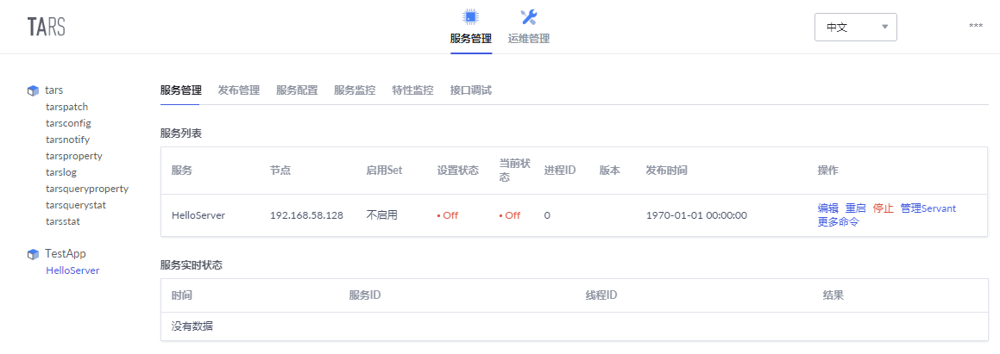
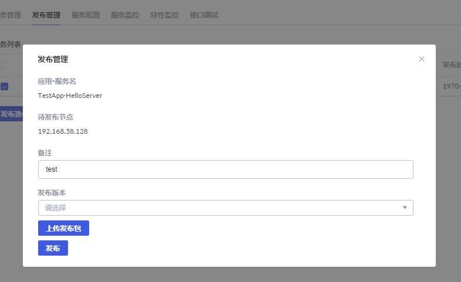
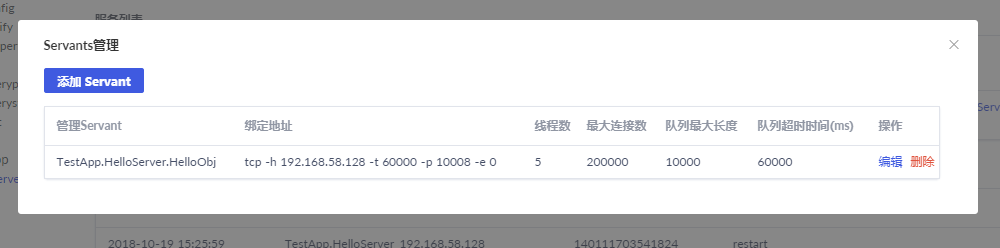

# 引言
在 [tars install](./tars_install.md) 中详细的介绍了tars的安装，部署了如下开发环境：  
 - mysql主从环境  
 - tars cpp开发环境(cpp rpc实现)   
 - tars框架爱的基础服务  
 - tars的web管理端  
接下来学习如何使用tars进行开发，这里的例子很简单，客户端发出hello world!，服务端返回，并在客户端输出。  

## 编写服务端
我们是在虚拟机上搭建的开发环境，为了使用windows上的编辑器，我们打算使用虚拟机vmware的共享文件夹功能，vmware默认情况下，共享文件夹过载在：/mnt/hgfs/下，我这里使用的是：/mnt/hgfs/CentOSOne/，并创建了自己学习的目录，最后得到如下目录：  
1. cd /mnt/hgfs/CentOSOne/tars_study/HelloServer  
2. 创建tars协议文件：Hello.tars，内容如下：  
```tars
module TestApp
{
interface Hello
{
    int test();
    int testHello(string sReq, out string sRsp);
};
}; 
```

3. 编写makefile：  
```makefile
APP       := TestApp
TARGET    := HelloServer
CONFIG    := 
STRIP_FLAG:= N
TARS_SSL := 1 之前在安装的时候设置了该选项，因此这里也设置这个值
INCLUDE   += 
LIB       += 

#-----------------------------------------------------------------------

include /usr/local/tars/cpp/makefile/makefile.tars   # 这个文件非常重要必须包含。
```

4. 执行 make release 翻译tars文件，生成对应的.h文件和.cpp文件，同时，该命令会生成其他的文件，并拷贝到响应的目录。这里你可能会有疑问，生成.h和.cpp不就可以了吗？是的，理论上没错，因为我们这里是微服务框架，各个服务之间会发起RPC调用，其他服务会依赖于这份协议，当我们在同一台机器开发时，我们开发的tars协议翻译成的文件为了被大家可见，就会放到一个公共目录，当其他开发者依赖我们的服务时，只需要在makefile中包含生成的.mk文件，然后直接使用.h文件就好了。这个只是在使用tars框架时的一个约定，并没有对错，你也可以选择自己合适的约定。那么我们看看这个命令做了些什么：  
```shell
[root@localhost HelloServer]# make release
update .HelloServer.d ...
In file included from HelloServer.cpp:18:0:
HelloImp.h:21:19: fatal error: Hello.h: No such file or directory
 #include "Hello.h"
                   ^
compilation terminated.
update .HelloImp.d ...
In file included from HelloImp.cpp:17:0:
HelloImp.h:21:19: fatal error: Hello.h: No such file or directory
 #include "Hello.h"
                   ^
compilation terminated.
make: Warning: File `.HelloServer.d' has modification time 4.7 s in the future
tars2cpp  
rm -vf Hello.h
tars2cpp  
/usr/local/tars/cpp/tools/tars2cpp   Hello.tars
[Copy file  Hello.tars Hello.h [Mm]akefile  ->  /home/tarsproto/TestApp/HelloServer]
‘Hello.tars’ -> ‘/home/tarsproto/TestApp/HelloServer/Hello.tars’
‘Hello.h’ -> ‘/home/tarsproto/TestApp/HelloServer/Hello.h’
‘makefile’ -> ‘/home/tarsproto/TestApp/HelloServer/makefile’
echo "INCLUDE += -I/home/tarsproto/TestApp/HelloServer"  >  /home/tarsproto/TestApp/HelloServer/HelloServer.mk;
make: warning:  Clock skew detected.  Your build may be incomplete.
[root@localhost HelloServer]# ll
```
 - > 如上该命令 首先删除原来的文件：Hello.h  
 - > 利用工具tars2cpp生成Hello.h 文件。  
 - > copy文件到/home/tarsproto/TestApp/HelloServer, 改目录中的文件如下：  
 ```shell
[root@localhost util]# ll  /home/tarsproto/TestApp/HelloServer/ 
total 36
-rwxr-xr-x. 1 root root 23886 Oct 19 15:59 Hello.h
-rw-r--r--. 1 root root    49 Oct 19 15:59 HelloServer.mk
-rwxr-xr-x. 1 root root   831 Oct 19 15:59 Hello.tars
-rwxr-xr-x. 1 root root   392 Oct 19 15:59 makefile
 ```
其中HelloServer.mk很重要，调用该服务的其他服务需要包含该mk文件。   

5. 编写服务端 
在HelloServer下包含如下文件：  
```shell
[root@localhost HelloServer]# ls
HelloImp.cpp  HelloImp.h  HelloServer.cpp  HelloServer.h  Hello.tars  makefile
```
各个文件内容如下：  
**HelloServer.h:**  
```C++
#ifndef _HelloServer_H_
#define _HelloServer_H_

#include <iostream>
#include "servant/Application.h"

using namespace tars;

class HelloServer : public Application
{
public:
    virtual ~HelloServer() {};

    virtual void initialize();

    virtual void destroyApp();
};

extern HelloServer g_app;
#endif
```

**HelloServer.cpp:**   
```C++
#include "HelloServer.h"
#include "HelloImp.h"

using namespace std;

HelloServer g_app;

void HelloServer::initialize()
{
    //initialize application here:
    addServant<HelloImp>(ServerConfig::Application + "." + ServerConfig::ServerName + ".HelloObj");
}

void HelloServer::destroyApp()
{
    //destroy application here:
}

int main(int argc, char* argv[])
{
    try
    {
        g_app.main(argc, argv);
        g_app.waitForShutdown();
    }
    catch (std::exception& e)
    {
        cerr << "std::exception:" << e.what() << std::endl;
    }
    catch (...)
    {
        cerr << "unknown exception." << std::endl;
    }
    return -1;
}
///////////////////////////////////////////////////////////
```
在文件HelloServer中，如下这一句是非常重要的：  
```C++
addServant<HelloImp>(ServerConfig::Application + "." + ServerConfig::ServerName + ".HelloObj");
```
这一句就决定了部署时该服务监听的servant名字。为：TestApp.HelloServer.HelloObj， 同时，实现业务逻辑的类名为：HelloImp。 

RPC接口的实现文件：HelloImp.cpp  HelloImp.h内容如下：  
**HelloImp.h：**  
```C++
#ifndef _HelloImp_H_
#define _HelloImp_H_

#include "servant/Application.h"
#include "Hello.h"

class HelloImp : public TestApp::Hello
{
public:
    virtual ~HelloImp() {}

    virtual void initialize();

    virtual void destroy();

    virtual int test(tars::TarsCurrentPtr current) { return 0;};

    virtual int testHello(const std::string &sReq, std::string &sRsp, tars::TarsCurrentPtr current);
};
#endif

```

**HelloImp.cpp：**  
```C++
#include "HelloImp.h"
#include "servant/Application.h"

using namespace std;
void HelloImp::initialize()
{
    //initialize servant here:
    //...
}

void HelloImp::destroy()
{
    //destroy servant here:
}

int HelloImp::testHello(const std::string &sReq, std::string &sRsp, tars::TarsCurrentPtr current)
{
    TLOGDEBUG("HelloImp::testHellosReq:"<<sReq<<endl);
    sRsp = sReq;
    return 0;
}
```

6. 编译： make，生成HelloServer  

7. 部署 ：
 - 申请：注意填写的各个参数值。特别设计应用名称，服务名称，Obj名称。  
    
 - 申请之后：  
   
 - 发布：  
     
    

如上就完成了服务端的编写。接下来编写客户端。  

## 编写客户端
1. 编写makefile
```makefile
APP       := TestApp
TARGET    := TestHelloServer
CONFIG    := 
STRIP_FLAG:= N
TARS_SSL := 1
INCLUDE   += 
LIB       += 

include /home/tarsproto/TestApp/HelloServer/HelloServer.mk  # 这个一定要包含，之前说过的
include /usr/local/tars/cpp/makefile/makefile.tars    # 这个也要包含
```
2. 编写客户端 
```C++
#include <iostream>
#include "servant/Communicator.h"
#include "Hello.h"

using namespace std;
using namespace TestApp;
using namespace tars;

int main(int argc,char ** argv)
{
    Communicator comm;   // 客户端通信器
    try
    {
        HelloPrx prx;
        // 获得服务端代理
        comm.stringToProxy("TestApp.HelloServer.HelloObj@tcp -h 192.168.58.128 -t 60000 -p 10008" , prx);
        try
        {
            string sReq("hello, world!");
            string sRsp("");

            int iRet = prx->testHello(sReq, sRsp);
            cout << "iRet:" << iRet << endl << "sReq:" << sReq << endl << "sRsp:" << sRsp << endl;

        }
        catch(exception &ex)
        {
            cerr << "ex:" << ex.what() << endl;
        }
        catch(...)
        {
            cerr << "unknown exception." << endl;
        }
    }
    catch(exception& e)
    {
        cerr << "exception:" << e.what() << endl;
    }
    catch (...)
    {
        cerr << "unknown exception." << endl;
    }

    return 0;
}
```
如上是一个最简单的客户端。其中很重要的就是：  
```C++
comm.stringToProxy("TestApp.HelloServer.HelloObj@tcp -h 192.168.58.128 -t 60000 -p 10008" , prx);
```
该句设置了将要调用的服务端servant信息：ip、端口等。这个信息可以在如下地方获取：  
 > web管理端 -> servant管理：
    

在这里你可能会问：这太不合理了，在互联网服务端，经常涉及到服务的扩容和迁移，IP、端口等变了怎么办？难道要重新编译发布？肯定不是这样的啦，框架肯定会有服务发现机制。这里我们只是构建一个最简单的例子，随着学习的深入，你会了解到框架如何做到服务发现。  

3. 编译执行
```shell
[root@localhost Client]# make
[root@localhost Client]# ./TestHelloServer 
2018-10-21 14:42:44|CommunicatorEpoll::run id:19765
iRet:0
sReq:hello, world!
sRsp:hello, world!
```
如此，一个完整的客户端和服务端就编写完成了。这个例子的目的就是快速感受一下  

## 部署中遇到的问题
之前搭建好了开发学习环境，后来在关机之前，将虚拟机挂起了，但是当我再次重启的时候，虚拟机没有网卡，后来重新挂起虚拟机，然后又执行可以了，但是我发现web管理端访问有问题，自己去排查，发现web管理端的进程是在运行的。那肯定就是web管理端调用的服务有问题。通过ps aux | grep tars 发现，tarsnode服务没有启动，后来发现是我的/etc/hosts没有生效，然后重启网络：service network  restart， 启动tarsnode，ok了。  

这里想说明的是，遇到问题要层层分析，不要慌乱。  


