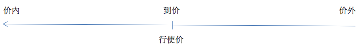

# 概述
本文主要学习窝轮(认股证)的基本知识。有些知识在[牛熊证]()中介绍了，这里不再学习。具体包含几个内容：  

1. 窝轮初体验   
2. 为什么投资窝轮  
3. 窝轮价格初解  
4. 窝轮价格的影响因素  
5. 引申波幅详解  
6. 兑换比率及街货量  
7. 窝轮敏感度的计算  
8. 窝轮到期的结算  
9. 选择窝轮五步曲  
10. 窝轮实战：锁利及对冲  
11. 窝轮与牛熊证的比较  
12. 窝轮与期权的比较  
13. 时间值与溢价​  
14. 窝轮牛熊证价格变化及其相关因素  
15. 再次认识认沽证  
16. 参考链接

# 1. 窝轮初体验
## 1.1 什么是窝轮
窝轮，是英文warrant的译音，真正的用词是认股证，是指一个**权利**，可以让投资者在指定的日期，用指定的行使价，购买或者沽出相关资产，这涉及的资产，可以是股票、指数、商品、货币、一篮子的股票，甚至是外国股票。虽然定义上是买卖相关资产，但实际上香港绝大部份的窝轮都以现金交收，意思是，只会计算输羸而不会有真正资产转移。  

窝轮当初出现的时候，是由上市公司发行的，用作集资，或者回馈雇员及股东，但后来发展下去，就多了一种由投资银行发行的衍生窝轮。衍生窝轮是一种在交易所买卖，让投资者部署某一种资产，还有可以向不同方向走的产品。既然窝轮是买入、或卖出相关资产的权利，基本来说，会有认购证和认沽证之分。  

涡轮分为认购证和认股证。  
**认购证**：顾名思义，是指让持有者拥有购入相关资产的权利，所以当相关资产的价格上升的时候，认购证价值理论上也会相对上升，属于看好的投资工具，香港散户会叫它为「Call 轮」。  

**认沽证**：与认购证相反，认沽证就是让持有者拥有沽出相关资产的权利，所以当相关资产的价格下跌，认沽证价值反则会上升，属于看淡的投资工具，香港散户习惯称为「Put 轮」。  

看一看这个表就一目了然了。总括来说，CALL就是看好，PUT就是看空：  
  
||认购证/ Call 轮|认沽证/ Put 轮|  
|-|-|-|  
|对后市看法|看升|看跌|  
|正股价格上升|窝轮价格上升|窝轮价格下跌|  
|正股价格下跌|窝轮价格下跌|窝轮价格上升|  
  
虽然窝轮在香港比牛熊证更早出现 (90年代，可能还比你更年轻)，但是窝轮对不少投资者来说，可能是更复杂的产品。学习过[牛熊证]()之后我们知道牛熊证有收回价、行使价、实际杠杆、兌换比率，到期日等条款，还有个强制收回机制；而窝轮呢？跟牛熊证一样，都会有行使价、实际杠杆、兌换比率，到期日等，但就没有牛熊证的收回价，不过就会受引伸波幅，和时间值损耗的影响。  

窝轮的名字结构如下：  


引伸波幅？时间值？是什么呢？接下来会进行学习的。  

## 1.2 窝轮常用名词
1. 相关资产：一般投资者较常参与买卖的相关资产为股票或指数，市场上亦有以ETF(交易所买卖基金) 丶商品或货币等等作为相关资产的认股证（窝轮）。  

2. 行使价：
 - 认购期权(CALL)持有人有权在到期日以行使价买入相关资产     
 - 认沽期权(PUT)持有人有权在到期日以行使价卖出相关资产    
 - > 但由於认股证(窝轮)是以现金结算，到期时会以现金结算，最差情况为0，详细计算方法可参考认股证到期结算方式
 - > 若投资者并非持有认股证(窝轮)至到期，选择窝轮时亦应选择行使价距离现货价不太远的产品
 - > 每只窝轮都有一个行使价，我们会用「价外、到价、价内」来形容三个不同的情况。先以Call轮为例，当行使价高过资产现价时，就会叫做「价外」，低过就叫「价内」。  
 - > Put轮的概念刚好相反，当行使价高过资产现价时，窝轮属于「价内」，低过就叫「价外」。  
 - > 而行使价刚好等同资产现价时，就会叫做「到价(也称为贴价)」。  

3. 到期日：认股证持有人的权利是设有限期的，到期日为持有人行使权利的日期，欧式认股证持有人在到期日才可向发行商行使换股权，美式认股证持有人则可在到期日或以前任何交易日行权。认股证到期後将会在交易所除牌，并自动结算。  

4. 时间值：认股证的价值是会随着股证接近到期而下降的，我们称之为时间值损耗，认股证价格随时间流逝而下跌的主因，是由於股证越接近到期，权利到期时被行使的预期价值亦会逐步下降。如投资者持有认股证一段较长时间，期间相关资产的价格无任何变化，则认股证价格亦会下跌。认股证的每日时间值损耗会随认股证的价值状况改变，越价外的认股证，其时间值损耗便越大。  

5. 最后交易日：认股证最後一日可在交易所内买卖的日期，如投资者在最後交易日前未有沽出认股证，便需等候股证结算。认股证的最後交易日为到期日前四个交易日。  

6. 对冲值：是量度窝轮价格对相关资产价格敏感度的指标，，数值介乎-1至1：[认购证为0至1，认沽证为-1至0] 
一般来说贴价(也称为到价)证的对冲值约0.5；愈价内则愈接近1，愈价外则愈接近0。其他不变的情况下，对冲值越大，窝轮价格对相关资产价格越敏感。   

7. 杠杆比率：杠杆比率以实际数字显示认股证与相关资产价格的倍数比例，计算公式为:  
```
相关资产价格/(认股证价格 x 换股比率)
```
杠杆比率都为正值。  
可见：认股证价格越低，杠杆比率越高。但投资者应该参考实际杠杆比率以计算窝轮的理论价格变化。    

8. 有效杠杆比率/实际杠杆比率：此比率反映相关资产价格每变动1%，认股证价格的理论变幅。如认购证丙之有效杠杆为3倍，即相关资产价格变动1%，该认股证理论上会变动约3%，反之亦然。此比率之参考价值较杠杆比率为高，更为「有效」及「实际」。以下是计算此比率的公式，主要是在计算杠杆比率时加入了对冲值参数:  
```
有效杠杆比率/实际杠杆比率 = 对冲值 x 相关资产价格 / (认股证价格 x兑换比率)
```
对冲值范围：[认购证为0至1，认沽证为-1至0]，因此，认购证的有效杠杆比率都大于0，认沽证的有效杠杆比率都小于0。  
投资者需留意，有效杠杆会跟随相关资产价格及其他因素影响而转变，并非长期维持在同一水平。有效杠杆越大，窝轮价格对相关资产价格越敏感。    

9. 换股比率/行使比率：认股证持有人需持有多少份认股证，才可兑换1份相关资产的权利。如某一中移动认购证甲之换股比率为100兑1，即投资者每持有100份备兑证，便可获得在股证到期时，以结算价换取一股中移动正股的权利。  
股份认股证的换股比率限定为1丶10丶100，指数认股证及其他相关资产的认股证之换股比率则只需为10之倍数。  

10. 街货量：街货量即市场投资者(除发行商外)持有的认股证份数，此数值有时会以百分比表示。如认股证的街货量为70%，即代表发行人尚持有30%的发行份数，其馀70%的发行份数已在市场上沽售予投资者，并由其他投资者持有。当认股证的街货量超过50%，发行商可申请增发股证，增发部份在三个交易日後上市。  

11. 溢价：一般是反映你如果持仓到到期日，正股需要上升或者下跌多少百分比，你才可以收回你现时买入窝轮的价钱。  

12. 引伸波幅：引伸波幅可被视为市场对相关资产价格未来波幅的预期，此数值的变化亦与场外(OTC)期权市场有关。  

13. 打和点：打和点指若投资者买入认股证并将其持有至到期日，相关资产价格所需上升/下跌至哪个价格，投资者才可打和。  
```
认购证打和点 = {[行使价 + (认购证价格 x 兑换比率)]
认沽证打和点 = {[行使价 - (认沽证价格 x 兑换比率)]
```

以上介绍了很多名词，不懂得话先不要紧，后续随着学习的深入慢慢理解。  

# 2. 为什么投资窝轮
认股证(窝轮)是港股中最受欢迎的上巿产品之一，香港更加是全球最大的窝轮巿场，究其原因主要是：  
- 杠杆效应： 投资者买卖认股证只需要付出较原来买卖相关资产相对少的资金，便可在相关资产价格的升跌下「以小博大」；  
- 有限损失： 与期权、期货不同，窝轮最坏的情况为损失全部本金，不需要补仓或被追收其他费用；  
- 灵活投资： 根据港交所批准可发行窝轮的股票数目有近400只，投资者非常多的选择：http://www.hkex.com.hk/Products/Securities/Derivative-Warrants/Derivative-Warrant-Eligible-Underlying-Assets?sc_lang=zh-HK  
- 交易成本： 与买卖股票不同，投资者买窝轮是不需缴付交印花税的，对於短炒的投资者可省下一大笔的交易成本；另外，大部份银行及证券商都提供窝轮交易优惠亦是吸引投资者炒窝轮的原因之一。  

# 3. 窝轮价格初解  
今天要跟大家介绍两个概念，分别是资产价格和时间，对窝轮的影响。  
## 3.1 价外、到价(也称为贴价)、价内
每只窝轮都有一个行使价，我们会用「价外、到价、价内」来形容三个不同的情况。先以Call轮为例，当行使价高过资产现价时，就会叫做「价外」，低过就叫「价内」。  
  
Put轮的概念刚好相反，当行使价高过资产现价时，窝轮属于「价内」，低过就叫「价外」，而行使价刚好等同资产现价时，就会叫做「到价」。  
   

投资者可能会问，行使价高或低，怎样影响我的选择呢？一般来说，越是价外，风险就相对越大，回报也理论上越高。就像爬山一样，假如你去全香港最高的大帽山爬山，目标打算爬500米，难度当然会低一点，看到的风景也还不错；但如果你再爬高一点，打算爬到上900米，难度当然会高一些，不过如果真的走到900米，看出去的风景，又会比500米漂亮的多，意思就是回报又多了了，但万一沿路很崎岖，随时走不到那么高，浑身都是汗之外还有可能什么风景都看不到。套回窝轮来说，价外幅度越高，窝轮倍大潜在利润的幅度就会越高，但风险就更大，如果看错了，输钱的幅度也会越大。  

接着就看年期，每只窝轮都有个到期日，简单来说，窝轮的年期愈长，价值就会越高。为什么呢？再用爬山的例子，要你爬上大帽山500米的位置，给你5个小时，和给你8个小时，哪个机会会大一些呢？当然是8个小时啦，因为你可以有更多时间去爬山嘛。  

套回窝轮，如果年期长一些，意思是有多点时间给正股，升到和跌到行使价的位置，多了时间就代表机会大一些，风险就自然低一点啦。相反，如果年期短一些的话，正股改变的时间就没那么多，风险就自然大一点，但潜在回报和亏损的幅度，也会更大。  

总结资产价格和时间这两个因素，就可以引伸到接下来的概念，就是一只窝轮的价值，主要由两部分组成，第一是内在值，第二是时间值。  

## 3.2 内在值及时间值
```
窝轮价值 = 内在值 + 时间值
```
内在值只是出现在**价内**轮身上，就是相关资产价格跟行使价的差距给予的价值，价外轮就没有内在值的；至于时间值就更简单，是指窝轮在到期日前所拥有的价值，年期长的价值比较大，年期短的价格就比较低。  

再用刚才的例子，5个小时是时间值，行使价是500米。 5个小时内去不到500米就好像窝轮未变成价内，这样内在值就等于0；但如果一早已经上到500米或以上，看到的额外风景就是赚到的内在值了。  

# 4. 影响窝轮价格的市场因素
上一节跟大家讲过，窝轮的价值，是由内在值和时间值所组成的，那么窝轮的价格受哪些因素影响呢？  

## 4.1 相关资产的价格
影响窝轮价格的主要因素有几个，第一，是相关资产的价格，这个相信大家会比较容易明白。以CAL​​L轮为例，一只价内轮，当相关资产的价格升得越高，资产价格和行使价的差距就越大，内在值就也会提升，从而利好轮价。即使是价外窝轮，如果相关资产的价格越高，就算还未到价，升穿行使价的机会也会增加，因此轮价理论上也会受惠。  

## 4.2 时间值
第二个因素，就是时间值。上一节提到，年期越长的窝轮，所包含的时间值就越大，但窝轮每天都有时间值损耗，到期越近，意味着剩下的时间值就会越来越少。所有窝轮到期时的时间值就会变做零，所以随着时间过去，不论是CALL轮或者是PUT轮，时间值都会逐步扣减，对轮价不利的哦。  

## 4.3 利率
第三个因素，是利率，一般就是指香港息率。当利率上升的时后，Call轮价格理论上会正面受惠，Put轮价格就会受到负面的影响。为什么呢？投资者买CALL轮的时候，某程度上是因为发行商代替投资者持有了正股，当利率上升时，持货成本增加，CALL轮就会贵了，相反PUT轮就会更便宜。不过香港息率接近零，窝轮年期普遍不够一年，利率这个因素的影响力根本是微乎其微。  

## 4.4 派息
第四是相关资产的派息。一般而言发行商会在沽出CALL轮后买入正股作为对冲。发行商在出一只窝轮的时候，已经根据过往派息的历史，将预期的股息计算到窝轮价格里，所以一般情况下，派息是不会影响到轮价的；不过，如果派息突然跟原本发行商预期有较大的出入，或者除息日跟以往不同，这样发行商原本预期会从股票上收取的股息有所变化，这就有机会影响到轮价了。举个例子来说，如果派息突然多过预期，除净后股价会减少，所以CALL轮价格会立刻反映并且下跌，而Put轮价格会上升。  

再举个例子，有只股份的股价是50元，本来它每年都派息1元，假如所有因素不变，减除息率就会变了49元；但有一年，它突破派息2元，减除息率就变成48啦，由于价格会自动变少，跟它挂钩的CALL轮，价格也会变少，而PUT轮就会高了。  

## 4.5 引伸波幅
最后一点，也是最多投资者不明白的一点，就是引伸波幅。引伸波幅是指市场对正股价格未来波动性的预测，简单来说，预期波动性越高，引伸波幅就会上升，call轮跟put轮价格都会受惠，但比喻说长假期之前，由于预期交投一般较静，这样引伸波幅就有可能下跌，于是call put轮价格都会受到负面的影响。下一节法巴学堂，我们会再详细讲解什么是引伸波幅。  

一口气讲了这么多，是时候总结一下，不同的因素怎样影响窝轮的价格，我们一眼看尽吧！  

|因素|变化|认购证 Call 轮|认沽证 Put 轮|  
|-|-|-|-|  
|相关资产价格|上升/下跌|价格上升/下跌|价格下跌/上升|  
|时间值|减少|价格下跌|价格下跌|  
|引伸波幅|上升/下跌|价格上升/下跌|价格上升/下跌|  
|利率|上升/下跌|价格上升/下跌|价格下跌/上升|  
|派息|多于发行人预期|价格下跌|价格上升|  

# 5. 引伸波幅详解
## 5.1 资产价格未来波动性预测
引伸波幅，是指市场对某一种资产的价格，未来波动性的预测。这个预测不是单一方向看升或看跌，而是整体上，讲述它的向上、向下的幅度有多大。  

什么意思呢？我们举个例子，重磅股汇丰(0005)，经常让人叫做「大笨象」，就是因为它变化较少，除非在个别大市波动的日子，否则通常都是变一点点，像只「大笨象」停下不动。由于市场通常都觉得，汇丰股价的波动性有限，所以汇丰窝轮的引伸波幅，通常都比较平穏。  

我们再举另外一个例子，这次说到赌业股银河娱乐(0027)，股价在2014年的高位，是84.5元，但是到2015年9月，低位不够20元(19.5元)，还不到两年，高低差距已经是3倍几！这让市场觉得，这只股份的价格波动性会比较高，发行商不敢掉以轻心，所以银河娱乐窝轮的引伸波幅，通常都会比较高。  

## 5.2 资产波动性与价格
还是不明白？大家可以回想一下我们去旅游购买保险的情况，如果去日本、新加坡这些治安比较好的国家，大家购买旅游保险的费用，是不是都比较便宜呀？但是如果我们去些战乱国家呢？旅行保险的收费一定贵很多！套入窝轮，波动性一般较大的股份，跟它挂钩的窝轮，引伸波幅都会高一些，就是大家的买入成本都可能要高一点！  

要留意的是引伸波幅是每一天、每个小时、甚至是每一分钟都会变！回想旅游买保险的情况，当某个国家的治安变差，又或者有旅游警示，保费是不是都会增加呀？  

套回窝轮，如果正股价格突然变得波动，发行商用作对冲窝轮的期权，引伸波幅都会变动，这样交易员就会把期权引伸波幅的变化，反映在窝轮的引伸波幅上，这样窝轮的引伸波幅就会出现变化。好像上一节课所说，引伸波幅升，call轮跟put轮价格理论上都会上升，而当引伸波幅下跌的时候，call/ put轮价格理论上都要下跌，明不明白呢？  

# 6. 兌换比率及街货量
## 6.1 兌换比率影响轮价
兌换比率的意思，就是控制1股股份所需要的窝轮股数，什么意思呢？大家有时候可能会发现，两只窝轮挂钩的资产一样，行使价一样，年期一样，连引伸波幅都差不多，为什么它们的价格会相差那么远，甚至是10倍以上呢？这个情况，很有可能就是它们的兌换比率不同。

举个例子说，一箱新鲜榨果汁有200瓶，价钱跟生果价格挂钩，会跟着生果的价格而有所变化。买了一箱回来，如果有10个人分，每一人就分到20瓶，就要付20瓶的价钱；但如果100个人分，每一人就分到2瓶，每个人所付的钱就会少一点，只需要付2瓶的价钱。

套回窝轮，兌换比率就好像有10个人分跟100个人分果汁一样，由于分到的果汁数量不同，每个人付的钱都不一样；就好像10对1跟100对1的窝轮一样，10对1的会比100对1的贵，只因除開的份數少了，价钱就会贵一点；而窝轮价格会受正股价格的影响，就好像果汁价格受到生果价格影响一样。

那不同的兌换比率对只窝轮有什么影响呢？其实是会影响到只窝轮的实际杠杆，如果比较10对1跟100对1的窝轮，假设行使价、到期日、引伸波幅等因素不变，10对1的选择，轮价会贵一点，实际杠杆会高一点；至于100对1的选择，轮价会便宜一点，但实际杠杆都会较便宜。实际杠杆是指窝轮与相关资产的理论价格变动比例，有关实际杠杆的详细解释，可以重温[牛熊证]()第一课。

## 6.2 街货量影响市场供求
至于街货量，就是指有多少街货在市場上，由其他投资者持有。发行商发行一只产品的时候，都会制订发行量，这是指发行商一开始有多少存货可以卖的数量。当产品上市后，有其他投资者买了并持有，这样街货量就会增加，发行商会每一天都把旗下每只产品的街货量上报港交所，投资者就可以使用报价机，或者发行商网站，看看每只产品在对上一个交易日收市的时后，有多少货量卖了在市場上。如认股证的街货量为70%，即代表发行人尚持有30%的发行份数，其馀70%的发行份数已在市场上沽售予投资者，并由其他投资者持有。当认股证的街货量超过50%，发行商可申请增发股证，增发部份在三个交易日後上市。      

那街货量這數據有什么用呢？其实这个也是投资者决定买一只产品时，需要考虑的因素之一，因为如果产品街货量偏多，发行商的开价能力就会受到影响，到时候供求因素有机会凌驾于其他因素之上，影响到窝轮的价格。  

还是不明白？又再举个例子，用个旧的例子，我们在牛熊证篇讲过卖演唱会门票，当门票差不多卖光的时候主办单位只剩布有限的票在手上，这就有机会让拥有门票的人，把价钱定在一个偏離合理的水平，同一个道理放到窝轮上，市场的供求就变成影响产品价格的一个重要因素。  

那你们可能会问，怎样才可以避免这个情况呢？部署之前，留意街货量是不是已经过高，部署之后，也该留意街货量有没有上升过高，如果升到了很高的水平，例如五成以上，就考虑一下是不是要换到另外一只产品啦。  

# 7. 窝轮敏感度的计算
窝轮敏感度的计算说了這么多影响窝轮价格的因素，好像是引伸波幅、时间值、街货等等，是时候要跟大家算算数，究竟一只窝轮是怎样跳动呢？温故知新，大家还记得這个表吗？  
## 7.1 最低买卖价位
  
它是不同股份，在不同价格范围内的最低买卖价格，這个概念在我们介绍牛熊证跳动敏感度的时候曾经说过，在窝轮上，一样可以大派用场，因为窝轮的敏感度计算，一样包括了它。  

## 7.2 股份轮跳动敏感度

一起看一看股份窝轮敏感度，意思是正股跳动1格，窝轮跳动多少的计算公式  
```
股份窝轮敏感度 = (正股最低买卖价位 x 对冲值) / (兌换比率 x 窝轮最低买卖价位)
```
跟计算股份牛熊证敏感度相比，牛熊证的对冲值通常接近1，但窝轮并非如此。  

对冲值反映的，是当挂钩资产价格跳动1元时，窝轮价格跳动多少% 的一个数值， 而这个数值，是会反映在报价机上，而它是会跟着正股价格、引伸波幅和剩余年期来变的。  

有了对冲值之后，窝轮又会怎样跳呢？我们举一只汇丰窝轮做例子  

||窝轮A|  
|-|-|  
|资产|汇丰控股|  
|行使价|52元|  
|认购/认沽|认购|  
|兌换比率|10|  
|对冲值|30%|  
|正股价格(元)|48元|  
|窝轮价格(元)|0.145元|   

這只窝轮，价格在0.25元以下，意思是窝轮的最低买卖价位是0.001元，而假设汇丰在48元，就是正股最低买卖价位是0.05元，至于兌换比率是10兑1，对冲值是30%，把数字代进公式里：  
```
股份窝轮敏感度 = (0.05 x 0.3) / (10 x 0.001) = = 1.5格
```
原来汇丰跳动1格，窝轮理论上会跳动1.5格，但由于没有半格的跳动，所以正股跳1格，窝轮理论上会跳动1格，而当跳到2格，窝轮理论上就会跳动3格，明不明白呀？  

## 7.3 指数轮跳动敏感度
如果是指数轮，首先要提醒大家，股份轮是跟随正股的跳动来走动，而指数轮是跟期指跳动的，所以敏感度的​​计算方法都有一点点不同，這个想法不是正股跳多少，窝轮就跳多少，而是究竟期指要改变多少点，才能让窝轮跳到一格，计算的公式是:  
```
指数窝轮敏感度 = (窝轮最低买卖价位 x 兌换比率) / 对冲值
```
举只恒指窝轮做例子:    

||窝轮B|  
|-|-|  
|资产|恒生指数|  
|行使价|20500点|  
|认购/认沽|认购|  
|兌换比率|6000|  
|对冲值|45%|  
|指数现价|20000点|  
|窝轮价格(元)|0.150元|   

這只窝轮，价格在0.25元以下，意思是窝轮的最低买卖价位是0.001元，兌换比率是6000兑1，对冲值是45%，把数字代进公式里：  
```
指数窝轮敏感度 = (0.001 x 6000) / 0.45 = 13.333点
```
说到這儿，相信大家都知道，当期指跳动13点，窝轮理论上就会跳动到一格。  

/**不过，以上的计算，只是计到理论变化，跟窝轮的实际变化通常都有出入，因为正股价格只是影响窝轮价格其中的一个因素，而引伸波幅、时间值、街货量、买卖差价等，一样会影响到窝轮价格，大家要留意哦！**/  

# 8. 窝轮到期的结算
上一节说完怎样计算窝轮跳动敏感度，今天继续计算，而算的是当一只窝轮到期时，应该怎样做结算。   

## 8.1 现金结算额
虽然大部分投资者，买卖窝轮一般都是做短线部署，不过如果买了之后，真的是一直持有至到期还未卖到，窝轮就会自动进行结算，价内窝轮将会收到「现金结算额」，而**价外轮的现金结算额是0(不会是负数，这也保证了窝轮的亏损最大为全部投入本金，不需要补仓或被追收其他费用,认识到这一点非常重要)**，大家还记不记得之前已经讲过，什么叫价外、到价和价内呀？  

## 8.2 窝轮结算方法
先讲窝轮的结算方法，CALL轮跟PUT轮的公式，分别是：  
```
认购证现金结算额 = (结算价 - 行使价) ÷ 兌换比率
认沽证现金结算额 = (行使价 - 结算价) ÷ 兌换比率
```
公式很简单，但什么是结算价呢，股份轮和指数轮的结算价，得出的方法都有些不同。  

## 8.3 股份轮结算方法
先说股份轮，结算价其实是指跟窝轮挂钩的相关资产，到期日之前五个交易日的平均收市价，记住是「之前」的五个交易日，到期日当天是不算的。  

这样说好像很容易，举个例子算一算才是最实际。  

有只汇丰认购证，行使价是50元，兌换比率是10兑1，今年3月30日到期。  

|日|一|二|三|四|五|六|  
|-|-|-|-|-|-|-|  
|21|22|23|24|25|26|27|  
|28|29|/*30*/|31||||  

算30日之前的五个交易日，好像个日历，不算星期六跟星期天，我们会用23, 24, 25, 26 和29号，这五天汇丰收市价的平均数为结算价。  

如果这五天的收市价，分别是52, 52.5, 51.8, 51.3, 52.2元，结算价就是(52 + 52.5 + 51.8 + 51.3 + 52.2)除以5，等于51.96元，这个是结算价；减去行使价50元，再除以兌换比率10对1，这只窝轮的现金结算价，就是每一股0.196元。  

## 8.4 指数轮结算方法
讲完股份轮，就到指数轮，它的结算方法简单很多。例如一只CALL轮，今年3月30日到期，3月24 日是最后交易日，如果投资者没有沽货，一直持有到到期，结算价我们会用到期当天的EAS (Estimated Average Settlement)，就是从官方公布，指数结算日当天，由上午9:35分起，至下午3:55分之间每5分钟的指数及当日指数收市价之平均水平作计价，作为结算， 这个数港交所在当天收市后就会公布的啦。  

有了结算价，代入刚刚讲过的公式，无论是CALL轮或PUT轮，一样簡單啦！  

值得提醒的，是如果计价日遇上平安夜、除夕或农历新年等半日市，半日收市价都会算进去； 不过，如果计价日有台风、暴雨或正股停牌等突发因素出现，结算方法可能会有所不同，如果遇到这样的情况，可以向相关发行商查询噢。  

# 9. 选择窝轮五部曲
我们一直在讲，说过窝轮的特性，影响价格的不同因素，还有敏感度、结算的方法等等，如果有投资者真是有兴趣想部署窝轮，其实应该怎做才好呢？为了方便大家，我们集诸家之大成，总结成一套心法，它就是「窝 轮 五 步 曲」！  

第一步，建立看法！  
无论买CALL或买PUT，首先是你要先有看法，你是看好还是看空？这个是方向问题。  

如果是看好，你看好的，是指数、股票、外汇、商品还是其他的？这个是选择问题，你要对特定的资产，有一个明确的看法，先可以再寻找它的相关产品。  

第二步，选杠杆！  
窝轮有以小博大的特性，而一只窝轮的实际杠杆，就是倍大潜在回报或者亏损的指标。  

高的实际杠杆，看对方向当然好，但如果看错方向，亏损都会倍大；如果实际杠杆低一些，看对方向可以获得的回报，可能会少一些，但看错方向的亏损都会少一点。  

而实际杠杆的高低，又取决于行使价的高低，以及年期的长短，假设其他因素不变，较价外的产品，实际杠杆会高一些，到价或价外的会低一些，而年期方面，短身的产品，实际杠杆会高一些，而长身的就会低一些，所以投资者可以根据自己承担风险的能力、和部署的时间，去选适合自己的产品。  

第三步，看引伸波幅！  
我们在第四课，已经讲解了什么是引伸波幅，投资者选了资产、方向和实际杠杆之后，可能都会发现有好几只产品，条款都差不多，怎样选好呢？  

留意一下引伸波幅，引伸波幅的高低，会影响到轮价的高低，但不是低引伸波幅、窝轮便宜一些就一定好，反而我们要留意的，是窝轮的引伸波幅，在过去一段时间是否维持稳定，大家都不想买了产品之后，引伸波幅又大上大落，稳定的引伸波幅，将可以减少持轮可能面对的变数，而引伸波幅的历史数据，可以在发行商的网站找到  

第四步，看街货量！  
这个比较简单，第五课都讲过，选了之后，如果窝轮街货特别高，就要留意它的价格可能较受市场供求影响，给大家一个提醒，很多时候引伸波幅较低的窝轮，街货都比较高，大家不要贪便宜呀！  

第五步，最后一步，看买卖差价！  
第六课时，教过大家计算窝轮跳动的敏感度，发行商会因应窝轮的敏感度，开出买盘和卖盘，而两者之间的差价，可能是投资者一买一卖的成本。  

要教大家「最佳买卖差价」的概念，是指根据产品的敏感度，而开出的合理差价，举例说，如果某窝轮是正股跳动1格，轮价理论上跳动2格，最佳买卖差价理论上就是2格。  

买卖差价当然愈窄愈好，因为代表投资者的买卖成本都可以减低。  

大家记住这些步骤，就可以试试在实战上，可不可以应用得到啦！  

# 10. 窝轮实战：锁利及对冲 
说了窝轮这么久，是不是想亲身参与一下？窝轮除了可以作为以小博大的投资工具，如果配合到正股买卖，还可以帮到大家配置资产组合，这一课会集中讲述两种策略，锁利跟对冲。  

## 10.1 锁利部署
先说锁利，顾名思义，就是怎样锁定利润。有时候投资者买了一只正股，上升了，有钱赚，当然很开心啦，但什么时候放好呢？放了，会不会还能升更多？但不放，会不会之后又下跌呢？心是不是十五十六呢？这个时候，窝轮帮到你。  
  

方法很简单，当你买了那只股票升了之后，先行沽出部分正股，先锁定一部分利润，再购入与同一资产挂钩的窝轮，由于窝轮具有以小博大的特性，投资者可以用较少资金，部署同一数量的正股。  

如果之后正股继续上升，当然再开心一点，因为股票跟窝轮价格都能够上升；但如果下跌呢？由于窝轮的成本较低，而且亏损都只是投入的全部本金，而你之前已经锁定了部分利润，如果数算得好，潜在亏损将会减低！  

至于这条数是怎样计算呢？有条方程式给大家参考:  
```
计划购入的窝轮数目 = (正股数量 / 对冲值)x 兌换比率
```
投资者选了想用来做锁利部署的窝轮之后，用它的对冲值跟兌换比率，代入这条方程式，再将沽出的正股数目代进去计算，就可以计到，究竟要买几多只窝轮，才能代替已经锁定利润的正股啦。  

## 10.2 对冲部署

至于对冲又是什么呢？当你买入股票后，当然希望它股价会上升，但又担心它会下跌，那该怎么办呢？这个时候，就可以考虑对冲部署啦，方法是，在买入正股的时候，同时买入与同一资产挂钩的认沽证。  

  

当正股股价上升时，认沽证可能会有亏损，但它最大损失都是投入的全部本金，以小博大的特性让它的成本减低了。虽然整个投资组合计算，会赚少了，但是利用认沽证买个安心，可以降低部署的风险。  

而且如果正股股价真的下跌呢？正股的投资者当然有亏损，但是认沽证价格会上升，带来的盈利可以抵销正股的亏损，整个投资组合来看，风险还是降低了。  

至于究竟要买几多认沽证呢？选了一只窝轮后，代入锁利的公式，就行啦。  

```
计划购入的窝轮数目 = (正股数量 / 对冲值)x 兌换比率
```

# 11. 窝轮与牛熊证的比较
来到这一刻，如果有看完我们法巴学堂，牛熊证跟窝轮的部分，应该都已经对两种产品，有一定的概念，那如果投资者对衍生工具有兴趣，应该选牛熊证、还是窝轮好呢？  

这个时候，我想大声的讲一句，「Why Not Both？」  

牛熊证跟窝轮，两种产品的特性不同，看看这个表：  
   

牛熊证跟窝轮一样，都是具有杠杆效应的产品，而且都有年期，意思是只可以在指定时间内作交投。  

不同的地方是，牛熊证设有收回机制，当相关资产价格到达收回价时，就会立即停止买卖等结算，就算之后相关资产的价格有所变动，都已经没仇报；而引伸波幅同时间值并非影响价格的重要因素。  

窝轮呢？就是没有收回机制的，一只CALL轮就算因为正股急跌而导致轮价急跌，之后如果正股在期内回升，窝轮价格都有机会回升，投资者可能会觉得「有仇报」；但是它就有引伸波幅跟时间值损耗，意思是影响它价格慨因素会多一些。  

其实牛熊证跟窝轮，都会因应不同条款，而有不同的杠杆，好难一概而论。如果投资者能够了解到两种产品的特性，灵活运作，那就无论看好或是看空，都得心应手啦！  

# 12. 窝轮与期权的比较
窝轮与期权的对比如下表：  

||期权|窝轮|  
|-|-|-|   
|权利/责任|买方拥有权利；卖方承担责任|权利|  
|风险（潜在亏损）|买方(CALL)的风险只限于所缴付的期权金;卖方(PUT)则承受无限风险|只限于买入认股证的价格|  
|获利机会（潜在回报）|买方拥有无限的获利机会；卖方的盈利则只限于所收取的期权金|无限|   
|按金要求|只适用于期权卖方（注）|无|  
|期权金成本|买方须缴付；卖方毋须缴付|需要|  
|行使方式|美式或欧式|美式或欧式|   
|按市价结算|每日|不适用|  

# 13. 时间值与溢价​
很多投资者会问，究竟窝轮的溢价和时间值有什么分别，简单说，溢价就是你持有窝轮到期的持有成本，至于时间值就是每天的时间损耗。  

一般情况，如果你是短炒窝轮，持仓可能只是几天或者一个星期，那你可能要多留意时间值。一般发行商的时间值会以每天作为计算单位，每天该窝轮理论应该要扣多少钱。假如你打算持货一个星期，那你的时间值损耗就是五天，所以在你买该窝轮之前,你要考虑到五天之后假如正股不升不跌你可能面对的时间值损失。无论认购证还是认沽证，愈接近到期日或者愈贴近行使价,时间值损耗都会愈大的。  

至于溢价，一般是反映你如果持仓到到期日，正股需要上升或者下跌多少百分比，你才可以收回你现时买入窝轮的价钱，所以溢价的考虑只是假设你持仓到到期日才会有关。如果你是短线买卖，就是可能买了几日后就卖出去，那溢价的考虑因素就不太大，因为可能你买入的时候溢价是偏高，但是只要你卖出的时候溢价可能依然存在的话，那其实你只要考虑买入价和卖出价的价差而已。**当然如果一不留神，买了窝轮之后被套牢，你就要留意溢价了，因为如果溢价太高，就是说正股可能要在到期日的时候升很多你才可以拿回本金，那这个时候你就要考虑是否要止损啦。**  

还有一点, 就是很多时候投资者会见到一些窝轮或者牛熊证会有负溢价出现，那为什么会有负溢价呢?  

由于部份股票会派发股息，未来的股价理论上会较现价为低，也可能会反映在指数上，因此牛熊证和窝轮的价格都要把股息因素反映出来，于是牛证和认购证的价格就会有负溢价，而熊证和认沽证的价格就会偏向有正溢价。  

想知道溢价怎样计算? 大家可以参考一下以下溢价公式：  
```
认购证打和点 = {[行使价 + (认购证价格 x 兑换比率)] }
认沽证打和点 = {[行使价 - (认沽证价格 x 兑换比率)] }
认购证溢价 = {[行使价 + (认购证价格 x 兑换比率)] - 相关资产价格} / 相关资产价格x 100% = 认购证打和点 / 相关资产价格 -1
认沽证溢价 = {相关资产价格 – [行使价 – (认沽证价格 x 换股比率)]}/ 相关资产价格x 100% = 1- 认沽证打和点/ 相关资产价格
```

# 14. 窝轮牛熊证价格变化及其相关因素
近年利用牛熊证及窝轮作短线投资的投资者越来越多，投资者对轮证计算的理解亦越来越成熟。一般而言牛熊证因为是价内产品，主要影响价格的因素是相关资产价格，其实近年利率上升，加上股票本身会派息，利率及股息亦会影响牛熊证定价。  

至于窝轮，理论上可以影响窝轮定价的因素有六个:  

1. 相关资产价格。简单而言，相关资产价格上升，CALL轮价格上升，而PUT轮价格下`跌，但为何有时会有机会在相关资产上升时，CALL轮价格不跟升呢。此时要留意窝轮之对冲值(DELTA)。对冲值是界定于0至1的数值，越接近零时表示窝轮对相关资产价格升跌越不敏感，一般会于相关资产价格远低于CALL轮的行使价时出现，特别是越短期的窝轮，因此，当发现窝轮的对冲值越小时，例如0.25或以下，便要注意相关资产的升跌未必会完全反映于轮价上。  
 
2. 行使价。行使价越高，CALL轮之价格越细。但因为窝轮的行使价在上市时已定，所以只影响投资者在挑选时的选择。  
 
3. 年期。年期越长，一般轮价亦越高，除非到期日跨越股息除净日。时间值(THETA)则是量度每日轮价的损耗指标，一般较长期的窝轮，每日时间值损耗会较细，但如果是短期的窝轮，每日时间值损耗会较大。如碰上短期而又价外的窝轮，时间值损耗大，但对冲值细，所以可能会出现正股升，但CALL轮反而因时间值损耗而倒跌的情况。  
 
4. 引伸波幅。引伸波幅亦是最多窝轮投资者摸不着头脑的变化因素，其实之前法巴学堂已有提过(「认股证篇」第四课：引伸波幅详解)。一般引伸波幅越高，轮价越贵。发行商一般会参考上市期权的引伸波幅水平加上价差，上市期权的引伸波幅其实亦可于港交所网站内查询。假如相关资产未有上市期权，一般则参考历史波幅再加上价差，但此类情况的波幅价差亦可能更大。  
 
5. 利率。自2008年金融海潚之后，港元长期处于低息环境，但10年过后美国加息亦令港元息口上升。息口上升，代表相关资产的远期价格亦理应上升来配合无风险回报，即是未来股票资产价值应该比目前贵。因此，CALL轮(及牛证)价格会变贵，PUT轮(及熊证)价格会相对较低。由于过往大部份时间亦是低息，如未来利率继续上升，投资者要多留意利率对产品价格之影响。  
 
6. 股息。最后，股票于派息除净后股价会变小，情况刚好与利率对股价的影响相反，所以派息越多，CALL轮(及牛证)价格会越低，PUT轮(及熊证)价格会越贵。  
想成为高阶的衍生产品达人，以上的价格变化因素，无论是单独比较或互相牵涉的影响下，均要好好领悟，以便在加息时，或股票除净前后，或大市突然波动或长期窄幅争持时，好好利用不同类型的投资工具作合适的部署。  

# 15. 再次认识认沽证  
香港市场上衍生产品繁多，牛证、熊证、CALL轮、PUT轮大家都可能听过买过。但Put轮一直以来也是最少被注意的产品，到底原因可在？  

首先从PUT轮的定义先说起，持有PUT轮就形同持有权利于到期日以行使价沽出资产。假如到期时资产低于行使价，持有PUT轮可获取资产价格与现价的差额，所以是投资者看淡资产的工具。当然，如果到期时资产高于行使价，相关PUT轮便没有任何价值。  

很多人会发现或问到，何解香港市场很少PUT轮？截至7月19日，香港市场上有659只PUT轮，只占所有窝轮总数7,261只的约9%，不足一成。CALL轮与PUT轮之数量有大差距，当中首要原因是与发行商对冲有关。当发行商沽出PUT轮时，发行商需要沽出股票对冲，因此假如发行商本来无持仓，便可能不能做到相关之对冲，因此要放弃推出PUT轮。  

举例而言，恒指PUT轮是以恒指期货作对冲，由于可以沽空，因此发行商没有对冲限制，所以市场上恒指CALL轮及PUT轮的数量比率是59%对41%。腾讯(700)，大部份发行商或多或少也会有股票持仓来对冲已售出之CALL轮，因此腾讯之CALL轮及PUT轮的数量比率也可达至80%对20%。但就算是蓝筹新贵石药集团(1093)，其CALL轮及PUT轮的数量比率只有97%对3%，其他更小的股票自然更难有PUT轮选择。  

# 16. 参考链接
[1 瑞信认股证教室](https://warrants-hk.credit-suisse.com/home/html/tutorial/warrants/warrants_tutorial_1_gb.html)  
[2 瑞银轮证教室](https://warrants.ubs.com/gb/education/warrant_tutorial)  
[3 平安证券认股证窝轮知识介绍](https://pacshk.kf5.com/hc/kb/article/1111309/)  
[4 法兴窝轮到期结算价值](https://hk.warrants.com/sc/warrant/settlement-price-at-expiry)  
[5 法兴认股证教室](https://hk.warrants.com/sc/education/warrant/article/intermediate)  
[6 摩根大通认股证及牛熊证资讯](http://www.jpmhkwarrants.com/zh_cn/education/page/1)  
[7 法巴轮证教学日志](https://education.bnppwarrant.com/sc/blog/details/20180720)  
[8 法国巴黎银行](https://education.bnppwarrant.com/sc/home)  
[9 法巴轮证课程](https://education.bnppwarrant.com/sc/course)  

